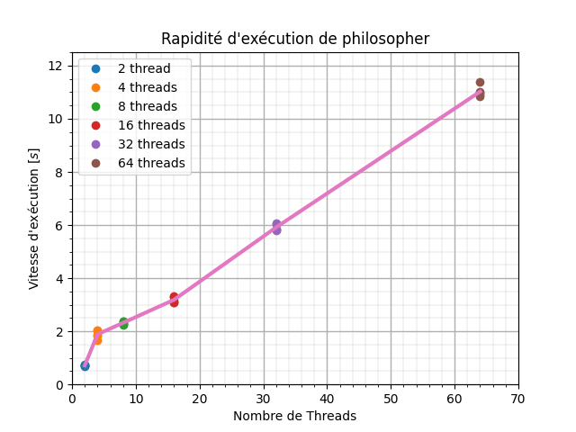
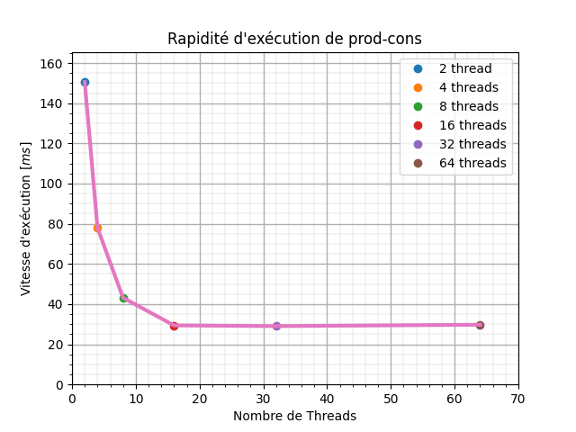
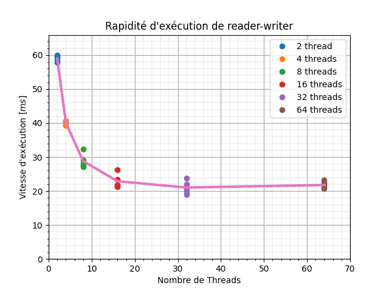

# Projet 1 - LINFO1252

- [Projet 1 - LINFO1252](#projet-1---linfo1252)
  - [Commandes Utiles](#commandes-utiles)
  - [Description](#description)
    - [Partie 1](#partie-1)
  - [Résultat](#résultat)
    - [Partie 1](#partie-1-1)

## Commandes Utiles

À exécuter dans le fichier P1 (source)

|     commande      |                                                  description                                                   |
| :---------------: | :------------------------------------------------------------------------------------------------------------: |
| `make` `make all` |                            Compile tous les fichiers `.C` des différentes parties.                             |
|    `make test`    | Lance le script bash [`eval.sh`](perf/eval.sh) qui relève les données sur la rapidité d'exécution et les plot. |
|   `make clean`    |                                     Supprime tous les exécutables générés.                                     |

## Description

### Partie 1
Nous avons implémenter le problème des philosophes dans ce [fichier](src/philosopher.c).

## Résultat

### Partie 1

Pour réaliser les tests de 

