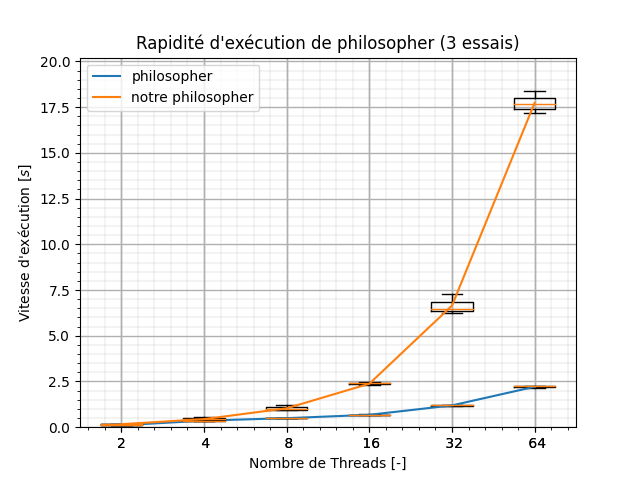

# Projet 1 - LINFO1252

- [Projet 1 - LINFO1252](#projet-1---linfo1252)
  - [Rapports](#rapports)
  - [Commandes Utiles](#commandes-utiles)
  - [Organisation de l'Archive](#organisation-de-larchive)
  - [Description](#description)
    - [Partie 1](#partie-1)
  - [Résultat](#résultat)
    - [Partie 1](#partie-1-1)
    - [Partie 2](#partie-2)

## Rapports

À retrouver [ici](https://www.overleaf.com/8891929774mqpwcprpgyjt#89f944).

## Commandes Utiles

À exécuter dans le fichier P1 (source)

|     commande      |                                                  description                                                   |
| :---------------: | :------------------------------------------------------------------------------------------------------------: |
| `make` ou `make all` |                            Compile tous les fichiers `.C` des différentes parties.                             |
|    `make test`    | Lance le script bash [`experiments.sh`](perf/experiments.sh) qui relève les données sur la rapidité d'exécution et les plot. |
|   `make clean`    |                                     Supprime tous les exécutables générés.                                     |
|    `make plot`    |                                     Refais les graphes et les sauvegarde.                                      |

## Organisation de l'Archive

- [~/perf](perf): répertoire lié aux tests de performances.
  - [/data](perf/data/): donnée des tests au format csv.
  - [/plot](perf/plot/): où est sauvegardé les graphes
- [~/src](src): répertoire avec le code source

## Description

### Partie 1

#### Philosopher
Nous avons implémenter le problème des philosophes dans ce [fichier](src/philosopher.c).

## Résultat

Tous les tests ont été réalisé sur des AMD Ryzen 7 5700U 8 coeurs 16 threads avec 16 Go de RAM à 4.4 GHz en boost. 

### Partie 1

Pour réaliser les tests de 

### Partie 2

à noter ici que la boucle for était borné jusqu'à $1000000$ itérations à chaque fois.

