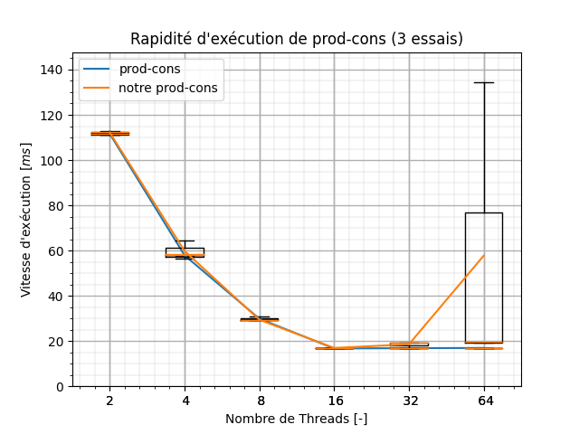
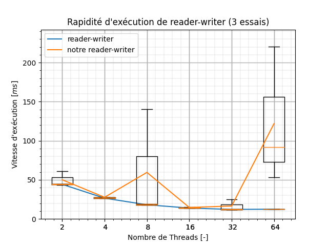
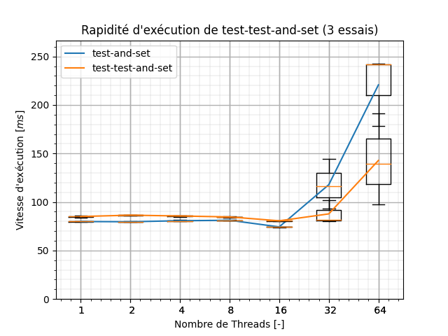

# Projet 1 - LINFO1252

- [Projet 1 - LINFO1252](#projet-1---linfo1252)
  - [Rapports](#rapports)
  - [Commandes Utiles](#commandes-utiles)
  - [Organisation de l'Archive](#organisation-de-larchive)
  - [Description](#description)
    - [Partie 1](#partie-1)
    - [Partie 2](#partie-2)
  - [Résultat](#résultat)
    - [Partie 1](#partie-1-1)
    - [Partie 2](#partie-2-1)

## Rapports

À retrouver [ici](LEPL1252_Projet_1.pdf).

## Commandes Utiles

À exécuter dans le fichier P1 (source)

|     commande      |                                                  description                                                   |
| :---------------: | :------------------------------------------------------------------------------------------------------------: |
| `make` ou `make all` |                            Compile tous les fichiers `.C` des différentes parties.                             |
|    `make test`    | Lance le script bash [`experiments.sh`](perf/experiments.sh) qui relève les données sur la rapidité d'exécution et les plot. |
|   `make clean`    |                                     Supprime tous les exécutables générés.                                     |
|`make deep-clean`| Comme `make clean` mais supprime également tous les graphiques au format png et pdf. |
|`make deep-deep-clean`| Comme `make deep-clean` mais supprime également les données de performance en csv.|
|    `make plot`    |                                     Refais les graphes et les sauvegarde.                                      |

## Organisation de l'Archive

- [~/include](include): répertoire avec les différents fichiers headers.
- [~/perf](perf): répertoire lié aux tests de performances.
  - [/data](perf/data/): donnée des tests au format csv.
  - [/plot](perf/plot/): où est sauvegardé les graphes.
    - [/pdf](perf/plot/pdf/): où est sauvegardé les graphes en pdf pour le rapport.
- [~/src](src): répertoire avec le code source.

## Description

### Partie 1

#### Philosopher
Nous avons implémenter le problème des philosophes dans ce [fichier](src/philosopher.c).

#### Producteur Consommateur
Nous avons implémenter le problème des producteurs consommateurs dans ce [fichier](src/prod-cons.c).

#### Read & Write
Nous avons implémenter le problème des écrivains dans ce [fichier](src/reader-writer.c).

### Partie 2

#### Test-And-Set

Nous avons implémenter un mutex basé sur l'attente active selon un test-and-set dans ce [fichier](src/test-and-set.c).

#### Test-And-Test-And-Set

Nous avons implémenter un mutex basé sur l'attente active selon un test-and-test-and-set dans ce [fichier](src/test-test-and-set.c).

#### Sémaphores

Pour réaliser les sémaphores, on a créé ce [fichier](include/sem.h) header qui utilise l'implémentation des locks en attente active via une stratégie *test-and-set*. 

#### Notre Philosopher
Nous avons implémenter le problème des philosophes  via nos implémentations de mutex et de sémaphores dans ce [fichier](src/philosopher_home.c).

#### Notre Producteur Consommateur
Nous avons implémenter le problème des producteurs via nos implémentations de mutex et de sémaphores consommateurs dans ce [fichier](src/prod-cons_home.c).

#### Notre Read & Write
Nous avons implémenter le problème des écrivains via nos implémentations de mutex et de sémaphores dans ce [fichier](src/reader-writer_home.c).

## Résultat

Tous les tests ont été réalisé sur serveur équipé de 32 coeurs avec 2 essais (donc 2 mesure par programme et par thread).

### Partie 1

On a comme résultat: 

### Partie 2

à noter ici que la boucle for était borné jusqu'à $1000000$ itérations à chaque fois.

