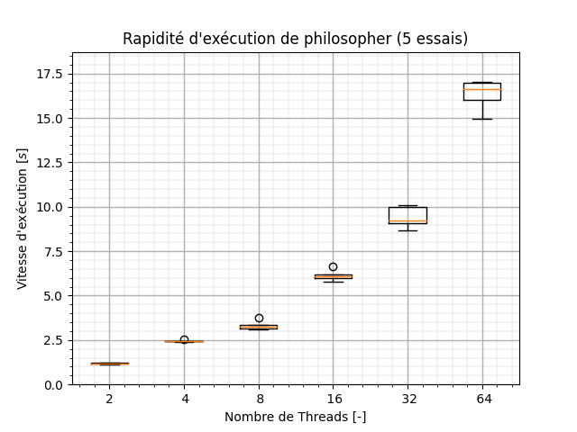
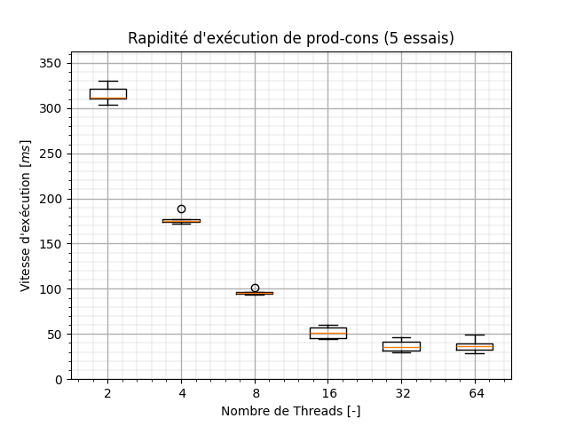
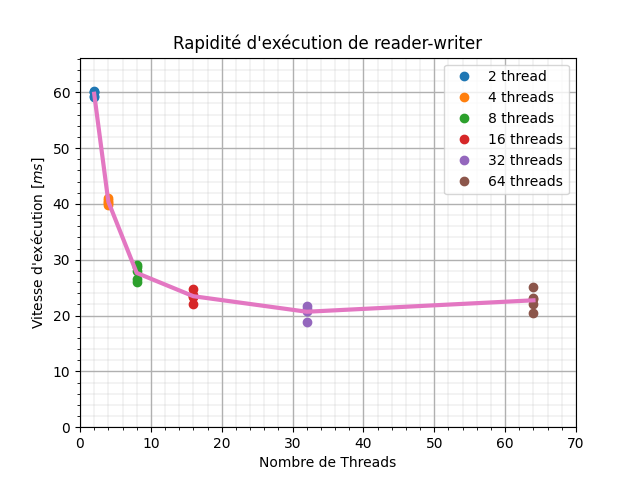
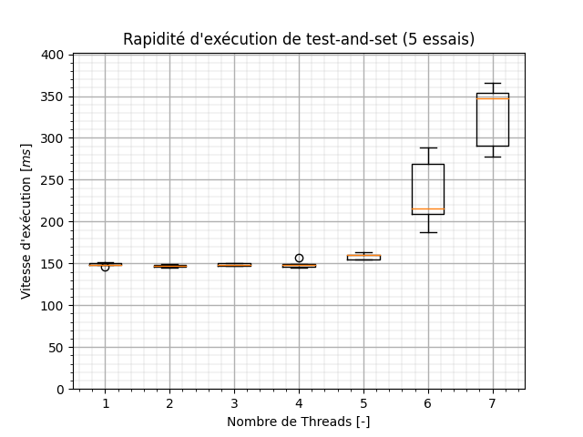

# Projet 1

*Groupe 5*

- [Projet 1](#projet-1)
  - [Tâches](#tâches)
    - [1](#1)
    - [2](#2)
  - [Graph](#graph)

## Tâches

### 1
- [x] Coder le problème des philosophes (*thomas*)
- [x] Coder le problème des producteurs-consommateurs (*matya*)
- [x] Coder le problème des lecteurs et écrivains (code du TD) (*matya*)
- [x] Écrire un script d’évaluation des performances (*thomas*)
- [x] Représenter graphiquement les résultats (*thomas*)

### 2

- [x] Mettre en œuvre un verrou par attente active utilisant l’opération atomique `xchg`, sur le modèle de l’algorithme test-and-set vu en cours  
- [x] Mesurez la performance du verrou test-and-set
- [x] Implémentez l’algorithme test-and-test-and-set
- [ ] Concevez une interface sémaphore sur la base de vos primitives d’attente active
- [ ] Adaptez vos 3 programmes de la partie 1 pour utiliser vos primitives d’attente active

## Graph 

