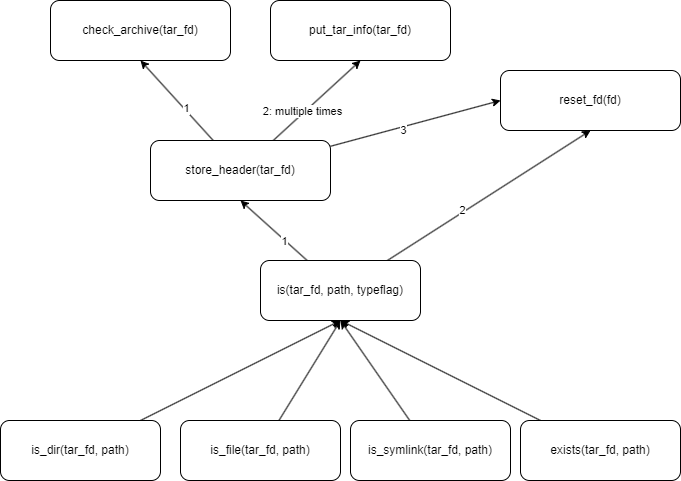

# Projet 2

- [Projet 2](#projet-2)
  - [Fonctionnements](#fonctionnements)
  - [Informations](#informations)

## Fonctionnements

## Informations

On peut retrouver toutes les informations sur `tar` [ici](https://www.gnu.org/software/tar/manual/html_node/Standard.html) et la man page est disponible [ici](tarInfo.txt).

