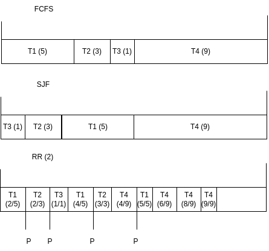

# TD 11

- [TD 11](#td-11)
  - [Question 1](#question-1)
  - [Question 2](#question-2)


## Question 1

On fait quelque chose du genre mdr:
```c
while(true){
    write(time)
}
```

Ainsi le fichier contiendra des timestamp avec le temps depuis l'epoch. On aura sûrement des trous dans les timestamp correspondant à un moment où le thread avait fini son burst.

## Question 2



| Scheduler |               Attente moyen               |                Réponse moyen                 |
| :-------: | :---------------------------------------: | :------------------------------------------: |
| **FCFS**  | $\frac{0+5+8+9}{4} = \frac{22}{4} = 5.5$  |   $\frac{5+8+9+18}{4} = \frac{40}{4} = 10$   |
|  **SJF**  | $\frac{0+1+4+9}{4} = \frac{14}{4} = 3.5$  |   $\frac{1+4+9+18}{4}= \frac{22}{4} = 5.5$   |
|  **RR**   | $\frac{0+2+4+5}{4} = \frac{11}{4} = 2.75$ | $\frac{13+10+5+18}{4} = \frac{46}{4} = 11.5$ |

L'attente moyenne peut être quasi nulle via **RR** si on prend un temps d'attente minimum.