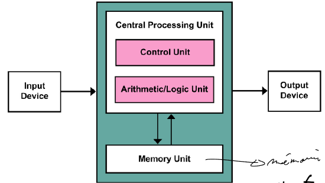

[<--](../README.md)

___

**DISCLAIMER:** toutes les illustrations proviennent du cours dispensé par E. Riviere et ne sont en aucun cas ma propriété. 

La synthèse est incomplète, a des erreurs ou autres choses ? Faites une Pull Request sur le dépôt [Github](https://github.com/Tfloow/LINFO1252). 

Si la synthèse vous a aidé, n'hésitez pas à rajouter une étoile au dépôt, ça fait toujours plaisir 🫶.

# Cours 1


## Fondamentaux

On a des composants:
- RAM, CPU, IO devices, ...

Le processeur exécute des *instructions*.

- Lire / écrire en mémoire vers / depuis des registres
- Opérations sur ces registres

Il y a 2 grandes familles *X86_64* et *ARM A64* avec des jeux d'instructions différents.

### Architecture de von Neumann



## Représentation des données

On a typiquement:

| taille  |   nome   |
| :-----: | :------: |
| 4 bits  |  nibble  |
| 8 bits  |  octet   |
| 32 bits |   mot    |
| 64 bits | long mot |

## Fonctionnement d'un système informatique

Les opérations d'entrée/sortie se déroulent de manière *concurrente*. Chacun a un contrôleur qui a une mémoire spécifique. Le processeur doit transporter les infos de la mémoire classique à la zone des contrôleurs.

Un processeur n'est pas de base parallélisé. À chaque frappe du clavier, une **interruption** est lancée pour intercepté ce stimulis.


### Interruption

Le processeur va s'arrêté dans son exécution et va *transférer* le contrôle du processeur à une routine de traitement.

La routine de traitement va déterminer la source de l'interruption

Il va positionner le compteur de programme à la *première* exécution du segment de code associé à cette *source*.

À la fin du traitement, on restaure l’état du processeur et on reprend le processus interrompu en restaurant le compteur de programme

## Opérations d'entrée/sorite


## Accès direct à la mémoire

Pour chaque touche de clavier, on doit interrompre pour que le processeur utilise ces données.

Pour éviter les interruptions qui vont à l'infini, on utilise du **DMA** qui est *l'accès direct à la mémoire*. Cela permet un transfert direct entre le contrôleur de périphérique et la mémoire principale.


## Le rôle du système d'exploitation

Le système d'exploitation se met entre l'utilisateur et le matériel. Il a 3 rôles:

1. Rendre plus simple le développement de programmes
2. Utilisation plus efficaces des ressources
3. Assurer l'intégrité des données et des programmes entre eux.


## Virtualisation

Le système d'exploitation assure cela en **virtualisant** les ressources matérielles. On va donc utiliser des API,...

### Exemple

- Processus
- Le programmeur a l'impression d'avoir tout le processeur
- Processus coexiste et s'entremêle
- Partage du temps dt des ressources
- Virtualisation de la mémoire
  - Plusieurs processus en mémoire.
  - On empêche que les autres processus lisent la mémoire des autres
  - Le SE gère la correspondance entre les adresses de la mémoire *virtuelle* et les addresses physiques

## Compromis abstraction/coût

Cela facilite énormément la vie du programmeur.

**Mais** on doit à chaque fois recalculer et cela coûte cher en calcul.

**Cependant** on a pu réduire ce coût de calcul via l'ajout de fonctionnalités aux processeurs.

## Séparation entre mécanisme et politique

Via la virtualisation par exemple:

1. Mécanisme de partage de temps:
   - Changement de contexte: sauvegarde l'état du processeur et restaure
2. Politique arbitre entre les processeurs pouvant s'exécuter et les processeurs disponibles:
   - Politique d'ordonnancement (*scheduling*)

On peut donc changer les *politiques d'ordonnancement* différentes selon les besoins mais avec le même mécanisme.

## Modes d'exécution

- **Utilisateur**: programme utilisant les abstractions fournies par le SE.
- **Protégé**: utilisé par le noyau du SE, toutes les instructions sont autorisées

L'utilisation de fonctionnalités du SE par un processus utilisateur nécessite de passer d'un mode à l'autre. (*appel système*)

## Appel système == interruption


## En Résume

Système d'exploitation ~= traitement des interruptions

- Interruptions matérielles (IO)
- Interruptions du processeur (instructions illégales user)
- Interruptions logicielles (appels systèmes)

## UNIX

Est une famille de système d'exploitation.

Ici, on verra surtout GNU/Linux.
- Linux: kernel
- GNU: collection d'utilitaires et de librairies associés.


Il y a la philosophie *KISS*:
- *Keep It Simple, Stupid*
- Programme simple, petit, parfaitement adapté à une tâche ou fonction unique
- Facilité de composition de commandes

| Utilitaire  |                                        Fonction                                        |
| :---------: | :------------------------------------------------------------------------------------: |
|     cat     |            lire/afficher le contenu d’un fichier. ex : ``cat fichier.txt``             |
|    echo     |                            afficher une chaîne de caractère                            |
| head / tail |                        affiche le début ou la fin d'un fichier                         |
|     wc      |                             compte le nombre de caractères                             |
|     wc      |                      trie un fichier. ex:`sort -n -r scores.txt`                       |
|    uniq     | extrait les lignes uniques ou dupliquées d'un fichier trié. ex: `uniq -d students.dat` |

## La documentation

Chaque utilitaire possède une manpage. 

```man nom_utilitaire```

On a des sections de manuelles qui différencies et trie les utilitaires (librairie standard, appel système, ...)

1. Utilitaires disponibles pour tous les utilisateurs
2. Appels systèmes en C
3. Fonctions de la librairie
4. Fichiers spéciaux
5. Formats de fichiers et conventions pour certains types de fichiers
6. Jeux
7. Utilitaires de manipulation de fichier textes
8. Commandes et procédure de gestion du système

Donc parfois on doit préciser `man 1 printf`.

## Flux standards


On a 1 entrées, 1 sorties par défaut dans le shell (STDOUT) et une sortie d'erreur (STDERR)

| commande  |                                 action                                 |
| :-------: | :--------------------------------------------------------------------: |
| `< file`  |                redirige le contenu de `file` vers STDIN                |
| `> file`  |                      redirige STDOUT vers `file`                       |
| `>> file` | redirige STDOUT vers `file` et l'ajoute au bout d'un fichier si existe |
|`2<&1`| redirige STDERR vers STDOUT|

On a aussi des Pipes qui redirige le résultat de commande de STDOUT vers le STDIN d'une autre commande.

```bash
cmd1 | cmd2
```

## Script

En entête de script *interprété* il faut ajouter l'interpréteur (python, bash):

```bash
#!/bin/bash
echo "Hello, world"
```

### Arguments en ligne de commande

```bash
#!/bin/bash 
# $# nombre d'arguments 
# $1 $2 $3 ... arguments 
echo "Vous avez passé" $# "arguments" 
echo "Le premier argument est :" $1
echo "Liste des arguments :" $@
```

### Retour

On peut retourner le résultat de la dernière commande via `$?`. Si 0 c'est bon.

On peut envoyer des données dans `/dev/null` et c'est un trou noir.

On peut lire du contenu aléatoire dans `/dev/random`.

### Boucles ``for``

```bash
#!/bin/bash 
# exemple_for.sh 
students="Julie Maxime Hakim" 
for s in $students; do 
  l=`wc -l TP1-$s.txt | cut -d' ' -f1` 
  echo "Bonjour $s, ton compte rendu de TP comporte $l lignes."
done
```

- s prend successivement les valeurs présentes dans la liste d'entrée `$students`
       
___

[<--](../README.md)
