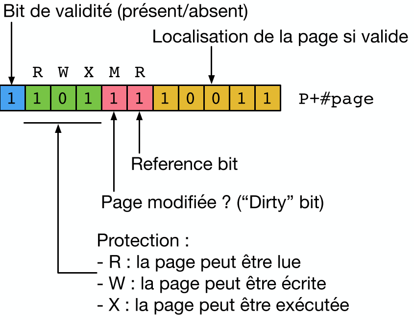
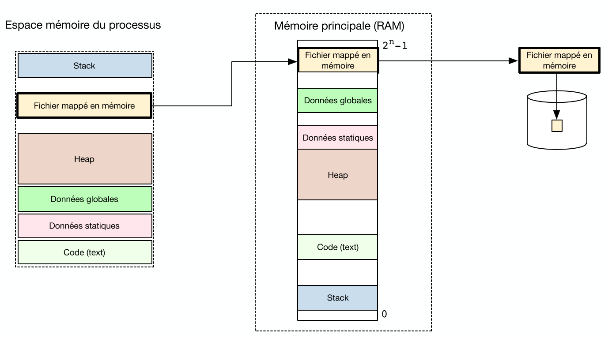
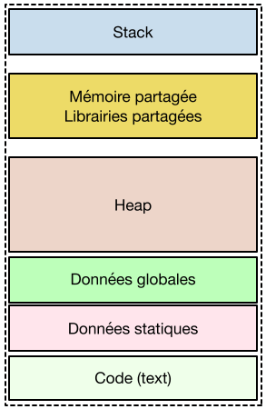
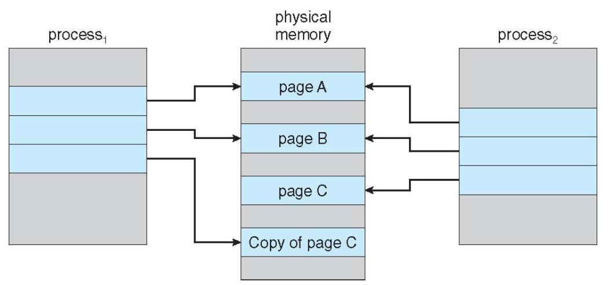

# Cours 10

## La mémoire

Accéder à la mémoire directement n'est pas une bonne solution car on doit connaitre son organisation à la compilation. Impossible car si on passe de 2 Go de RAM à 4 il faut tout recompiler !! On va virtualiser tout ça

### La Mémoire Virtuelle

On va devoir faire une traduction du virtuelle à physique via le **MMU** ou **Memory Management Unit** (qui est dans le processeur).


Ainsi on peut découpler la taille et écrire les adresses sur + de 32 bits.

On peut faire de la librairie partagée très facilement, on peut voir que 2 programmes pointes vers la même zone de la RAM !

#### Avantages

On peut utiliser le stockage sur le disque pour mettre des objets inutilisées de la RAM. C'est le principe de **`swap`**. Et on peut faire vice-versa.

### Fonctionnement de la mémoire Virtuelle

La mémoire a un accès par *adresse* et les SSD par *secteur*. La mémoire virtuelle est divisée par **pages**. C'est une zone de mémoire **contiguë** de taille 4 Ko (4096 octets (on peut vérifier via `getpagesize()`)).

On a toujours un nombre entier de pages. De plus, chaque segment (les 6) occupe leurs propres pages.

Ainsi, les pages virtuelles peuvent être placées dans n'importe quelle zone (*frame*/cadre de page) de la mémoire physique.

Adresse Virtuelle est composée de:

- Numéro de la page
- Offset sur cette page à faire

Le MMU se charge de la traduction.


### Mise en Oeuvre de la Traduction

Il doit avoir accès à l'allocation actuelle entre pages virtuelles et cadres de pages physique. On va utiliser une table des pages:

- Tableau indexé par le numéro de page
- Bit de validité si la page existe dans l'espace mémoire du *processus*
- Si valide: ligne du tableau indique le lien vers le numéro de cadre de page.


Chaque processus possède donc sa **propre table des pages** (pas pour le kernel). On a un registre spécial qui contient l'adresse de base en mémoire de la table des pages du processus actuel (restauré à chaque rétablissement de contexte).

#### Exemple pour 2 processus

Si on a un système 8 bits (RAM maximum de 256) ce qui nous donne 16 cadres de pages de 16 octets chacun. On décide d'avoir des adresses virtuelles sur 6 bits donc un maximum de 64 octets par processus (chaque processus va donc utiliser 4 pages --> 2 bits pour la page 4 pour l'offset).

Imaginons 2 processus `P1` et `P2` qui requiert 3 pages (2 pour leur text et 1 pour leur stack).


On remarque que faire la traduction entre adresse physique et virtuelle requiert 1 accès en plus. On va donc mettre en *cache* les traductions souvent utilisées via un **TLB** ou **Translation Lookaside Buffer** ce qui nous donne un fonctionnement de la sorte.


### Protection des Pages

On peut encoder les droits d'une page sur 3 bits: `R`, `W` et `X`. Si on essaye de faire une action invalide, on génère ainsi un trap qui passe la main au SE.

On peut retirer des droits à une page via:

```c
#include <sys/mman.h> 

int mprotect(const void *addr, size_t len, int prot);
```

### Problème du Swap

On a 2 façon de faire du swap (qui permet d'avoir plus de pages virtuelles):

1. Partition de Swap:
   - ✅ Rapide
   - ❌ Portion du disque dédiée
2. Fichier de Swap:
   - ✅ Flexible
   - ❌ Performance moindre (fragmentation du fichier)

#### Fonctionnement par défaut d'un accès à une page


On va donc devoir rapatrier des pages du disque vers la mémoire si on constate un défaut de page (ou en créer une nouvelle).

On va devoir aussi faire une politique de suppression des pages les plus anciennes et des moins utilisées. Cela va suivre des critères bien précis:

- Métadonnées qui ne rajoutent pas de la lourdeur (utilisée des bits des pages non utilisés)
- Ne pas supprimer des pages qui sont souvent utiliser ou va l'être.

On va **éviter** ces 2 politiques:

1. FIFO: supprimer les pages les plus anciennes. Ne prend pas en compte le fait qu'on utilise activement une page
2. Conserver des statistiques sur les accès: irréalistes et coûteux.

On va utiliser le principe du **LRU** ou **Least Recently Used** pour enlever la page utilisée en dernier. On va faire cela sans compter le temps. On va tous les X cycles d'horloges checker 2 bits spécifiques:

1. Dirty bit: page modifiée ? *page modifiée et à mettre à jour sur le disque*
2. Reference bit: page utilisée ? *page accédée récemment*



Après chaque check, le SE va mettre ces 2 bits à 0. On va supprimer en premier les pages qui sont `00` et `01` car elles ne sont pas accédées.

### Fichiers Mappés en Mémoire

On peut mapper le contenu d'un fichier dans la mémoire pour avoir plus simple à le manipuler (👀 oui [@Hokkaydo](https://media.discordapp.net/attachments/517720163223601155/1113851521029910569/GOODBOOOOOI.gif)) via cet appel système qui nous renvoie un pointeur vers la zone mappée ou un `MAP_FAILED`:

```c
#include <sys/mman.h> 

void *mmap(void *addr, size_t length, int prot, int flags, int fd, off_t offset);
/*
* addr:     où on veut mapper, Généralement NULL
* length:   longueur de la zone du fichier à mapper
* prot:     permission (R/W/X)
* flags:    mapping privé (MAP_PRIVATE) ou partagé entre processus (MAP_SHARED)
* fs:       descripteur du fichier
* offset:   où on veut démarrer à mapper
*/
```



#### Appels Systèmes Associés

On peut forcer l'écriture sur le disque (même idée de buffer que pour `printf`):

```c
#include <sys/mman.h> 

int msync(void *addr, size_t length, int flags);
```

Supprimer tout le mapping ou une partie

```c
#include <sys/mman.h> 

int munmap(void *addr, size_t length);
```

### Mémoire partagée

Quand on a plusieurs threads, la table des pages est copiée pour tous les segments **sauf le Stack**. 

On peut faire de la communication entre processus via de la mémoire partagée. Il faut que les entrées de la table des pages des deux processus pointent vers les mêmes frames physiques. 

#### Gestion de la mémoire partagée

|                         Fonction                          |                                                  Paramètre                                                   |                            Description                            |
| :-------------------------------------------------------: | :----------------------------------------------------------------------------------------------------------: | :---------------------------------------------------------------: |
|     `int shmget(key_t, key, size_t size, int shmflg)`     | `key`: une clé. `size`: taille de page. `shmflg`: on le met à `IPC_CREAT` pour créer sinon obtenir un accès. |     crée ou obtient l'accès à un segment de mémoire partagée      |
| `void *shmat(int shmid, const void *shmaddr, int shmflg)` |              `shmid`: id de la page qu'on a obtenu. `shmaddr`: mis à `NULL`. `shmflg`: mis à 0.              | Pour attacher la page partagée dans l'espace mémoire du processus |
|             `int shmdt(const void *shmaddr)`              |                                 `shmaddr`: l'adresse retournée par `shmat`.                                  |                       Pour détacher la page                       |

Il faut faire attention à ce que la mémoire soit bien attachée pour les deux processus. On va soit:

1. éviter d'utiliser des pointeurs (sinon il ne pointe pas vers les mêmes choses dans le processus)
2. stocker les adresses relatives au début de la zone mémoire partagée

#### Destruction des segments partagés

Les segments partagées vont continuer à exister même à la terminaison du processus créateur. On utilise `shmctl` pour supprimer un segment. La suppression se fera au dernier `shmdt`.

#### Librairie partagée

La zone mémoire liée aux librairies partagées se trouvent entre le stack et le heap et sera en `.so`.



### Fonctionnement de `fork` et `exec`

En faisant un `fork` on va faire une copie de la table des pages en mode read pour le segment text sinon en mode écriture, il faut réaliser une isolation le **Copy-on-Write**.

#### Copy-on-Write

Les pages sont déclarées en *read-only* donc essayer d'écrire va générer un trap. Le SE va vérifier si l'accès interdit est pour une page réellement en écriture. Si c'est le cas:

- La page est dupliquée vers une nouvelle page
- Table des pages mise à jour pour pointer vers cette copie
- On redémarre l'instruction qui a générée l'erreur

