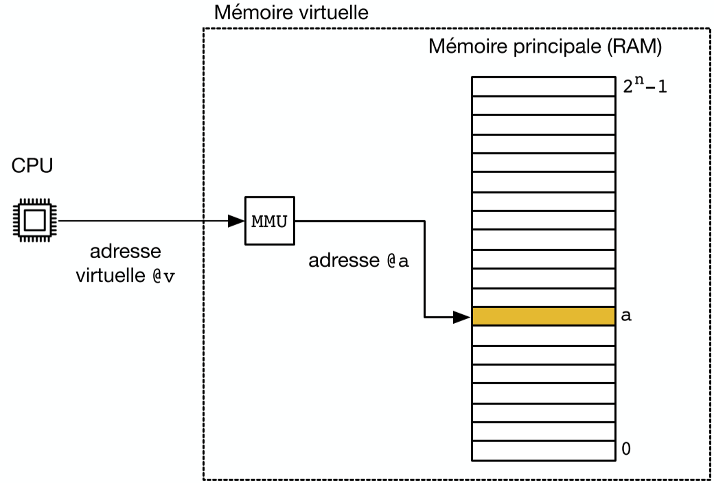
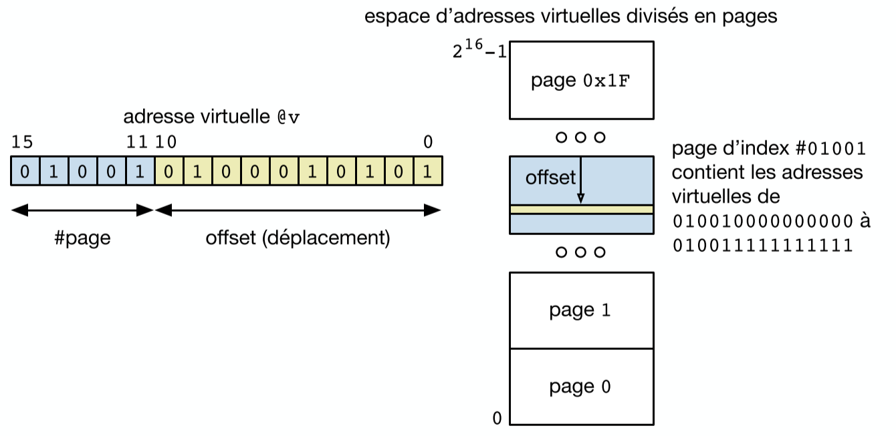
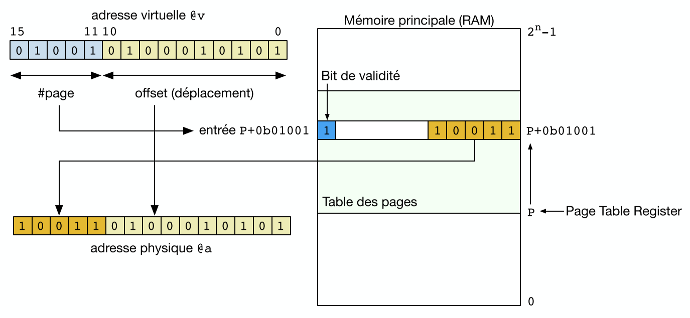
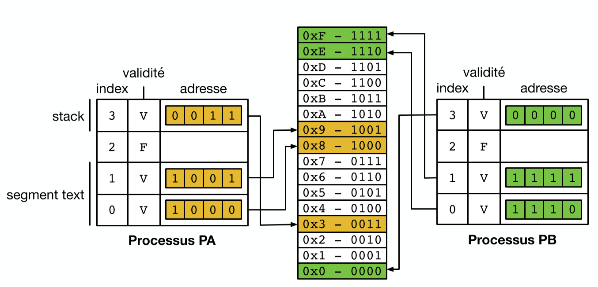
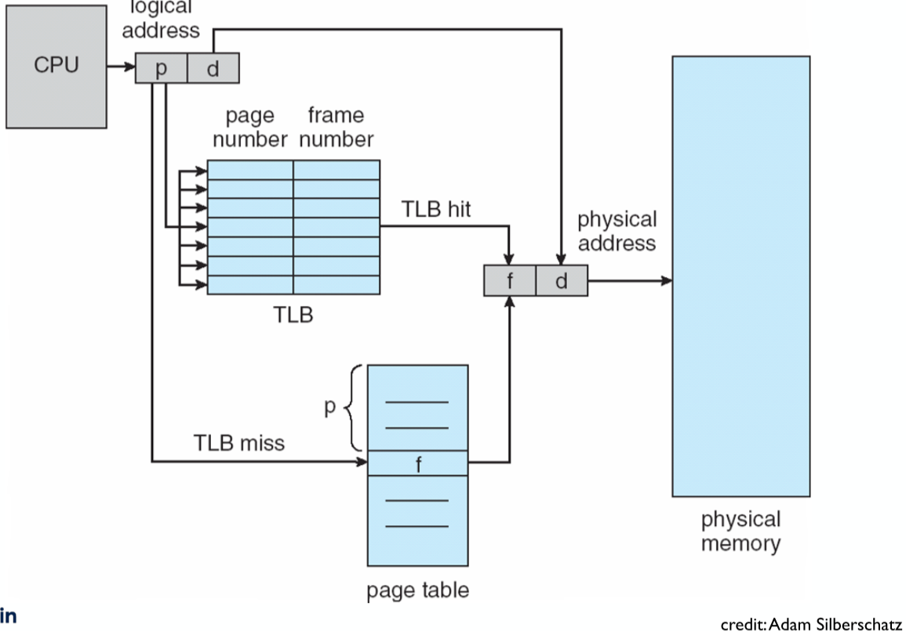
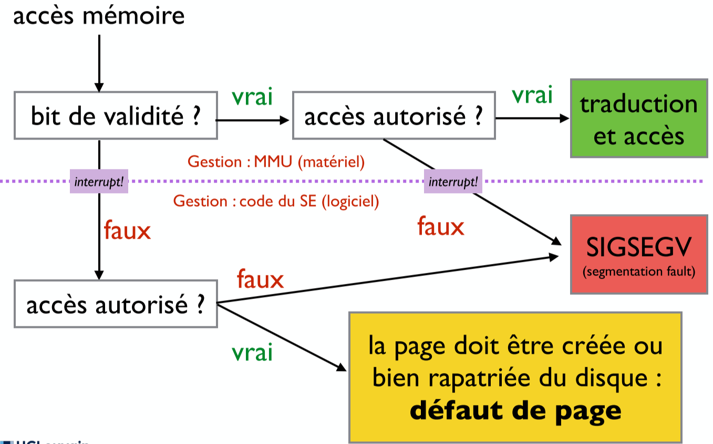
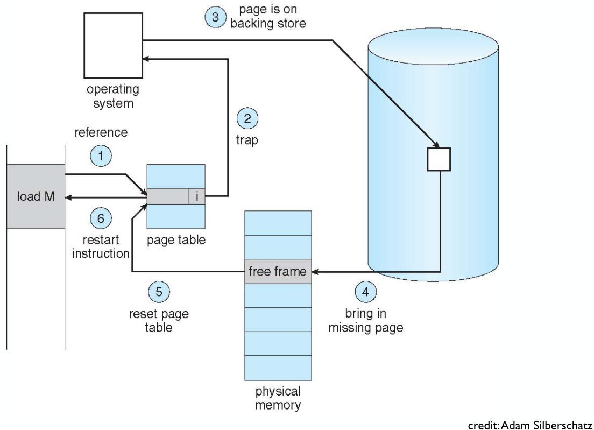

# Cours 10

## La mémoire

Accéder à la mémoire directement n'est pas une bonne solution car on doit connaitre son organisation à la compilation. Impossible car si on passe de 2 Go de RAM à 4 il faut tout recompiler !! On va virtualiser tout ça

### La Mémoire Virtuelle

On va devoir faire une traduction du virtuelle à physique via le **MMU** ou **Memory Management Unit** (qui est dans le processeur).



Ainsi on peut découpler la taille et écrire les adresses sur + de 32 bits.

On peut faire de la librairie partagée très facilement, on peut voir que 2 programmes pointes vers la même zone de la RAM !

#### Avantages

On peut utiliser le stockage sur le disque pour mettre des objets inutilisées de la RAM. C'est le principe de **`swap`**. Et on peut faire vice-versa.

### Fonctionnement de la mémoire Virtuelle

La mémoire a un accès par *adresse* et les SSD par *secteur*. La mémoire virtuelle est divisée par **pages**. C'est une zone de mémoire **contiguë** de taille 4 Ko (4096 octets (on peut vérifier via `getpagesize()`)).

On a toujours un nombre entier de pages. De plus, chaque segment (les 6) occupe leurs propres pages.

Ainsi, les pages virtuelles peuvent être placées dans n'importe quelle zone (*frame*/cadre de page) de la mémoire physique.

Adresse Virtuelle est composée de:

- Numéro de la page
- Offset sur cette page à faire

Le MMU se charge de la traduction.



### Mise en Oeuvre de la Traduction

Il doit avoir accès à l'allocation actuelle entre pages virtuelles et cadres de pages physique. On va utiliser une table des pages:

- Tableau indexé par le numéro de page
- Bit de validité si la page existe dans l'espace mémoire du *processus*
- Si valide: ligne du tableau indique le lien vers le numéro de cadre de page.



Chaque processus possède donc sa **propre table des pages** (pas pour le kernel). On a un registre spécial qui contient l'adresse de base en mémoire de la table des pages du processus actuel (restauré à chaque rétablissement de contexte).

#### Exemple pour 2 processus

Si on a un système 8 bits (RAM maximum de 256) ce qui nous donne 16 cadres de pages de 16 octets chacun. On décide d'avoir des adresses virtuelles sur 6 bits donc un maximum de 64 octets par processus (chaque processus va donc utiliser 4 pages --> 2 bits pour la page 4 pour l'offset).

Imaginons 2 processus `P1` et `P2` qui requiert 3 pages (2 pour leur text et 1 pour leur stack).



On remarque que faire la traduction entre adresse physique et virtuelle requiert 1 accès en plus. On va donc mettre en *cache* les traductions souvent utilisées via un **TLB** ou **Translation Lookaside Buffer** ce qui nous donne un fonctionnement de la sorte.



### Protection des Pages

On peut encoder les droits d'une page sur 3 bits: `R`, `W` et `X`. Si on essaye de faire une action invalide, on génère ainsi un trap qui passe la main au SE.

On peut retirer des droits à une page via:

```c
#include <sys/mman.h> 

int mprotect(const void *addr, size_t len, int prot);
```

### Problème du Swap

On a 2 façon de faire du swap (qui permet d'avoir plus de pages virtuelles):

1. Partition de Swap:
   - ✅ Rapide
   - ❌ Portion du disque dédiée
2. Fichier de Swap:
   - ✅ Flexible
   - ❌ Performance moindre (fragmentation du fichier)

#### Fonctionnement par défaut d'un accès à une page



