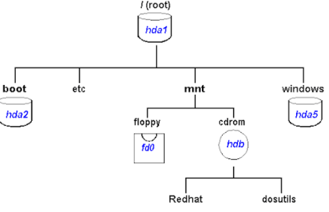
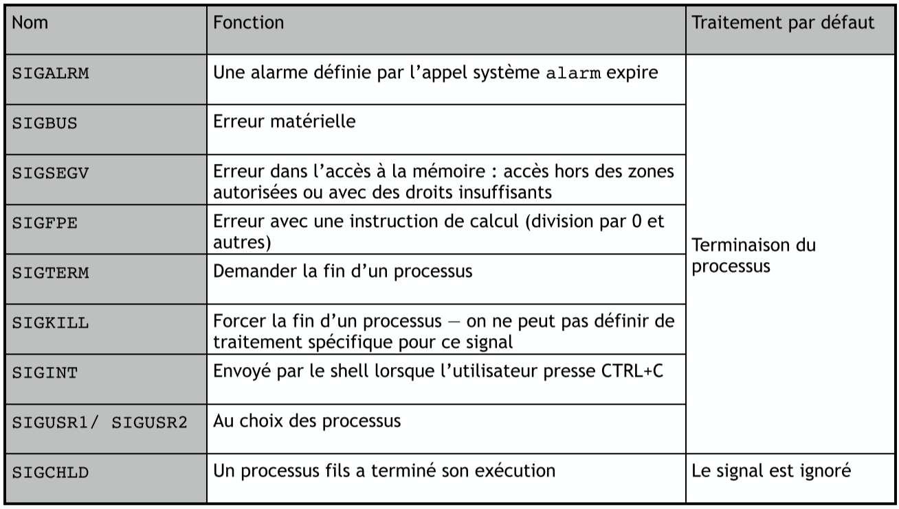

# Gestion des utilisateurs

Unix est pensé pour supporter plusieurs utilisateurs. On doit d'abord s'authentifier

## Authentification

On se connecte via un mot de passe en local ou distant (*ssh*). Il existe aussi les authentifications par données biométriques, cryptographie asymétrique (private key and public key).

Le premier processus au démarrage est le processus de `login` qui va lui fork tous les autres sous-processus. On liste tous les users dans `/etc/passwd`. On y stockait avant les mots de passe dedans mais maintenant on les stocke dans des fichiers séparés (*shadow password*).

### `/etc/passwd`

`oracle:x:1021:1020:Oracle user:/data/network/oracle:/bin/bash`

`1:2:3:4:5:6:7`

1. Nom d'utilisateur
2. Mot de passe (stocké dans `/etc/shadow`)
3. Identifiant User (**UID**)
4. Identifiant du groupe *principal* de l'user (**GID**)
5. Informations supplémentaires, nom complet de l'user
6. Répertoire *home*
7. Shell à exécuter au moment du login de l'user


### Types d'user

| type d'user  |                                             Description                                             |
| :----------: | :-------------------------------------------------------------------------------------------------: |
|     root     |                      Aucune restriction et peut tout faire. Admin du système.                       |
| User normal  |                    Droit limité mais peut obtenir des droits de root via `sudo`.                    |
| User système | Ne correspond pas un réel user mais correspond à des services du SE. (typiquement des daemons, ...) |

#### Obtenir leur **UID**

On utilise la fonction `getuid(2)` pour obtenir l'**UID** et `geteuid(2)` pour obtenir l'*effective **UID*** car il se peut que les droits changent temporairement (`sudo`).

#### Changer l'**UID**

On peut faire cela via `setuid(2)` qui modifie l'UID de l'utilisateur en cours d'exécution. Donc Root appelle `setuid` avant `execve` pour se donner les droits d'administration.

# Systèmes de fichiers

Il y a énormément de diversité en terme de support de stockage de données. Il faut donc une interface *commune*. En **UNIX**, les fichiers sont regroupés sous forme d'une arborescence unique.

## Hiérarchie et Montage



En utilisant `mnt` on peut attacher ou détacher des systèmes de fichiers dans la hiérarchie commune. Tout est un fichier en Linux (même le `/proc`).

## contenu d'un répertoire

```
$ ls -la / 
total 1488
drwxr-xr-x  19 root root    4096 Dec  9 14:35 .
drwxr-xr-x  19 root root    4096 Dec  9 14:35 ..
lrwxrwxrwx   1 root root       7 Apr 23  2020 bin -> usr/bin
drwxr-xr-x   2 root root    4096 Apr 23  2020 boot
drwxr-xr-x   9 root root    2820 Dec  9 14:35 dev
drwxr-xr-x 131 root root   12288 Dec  9 14:35 etc
drwxr-xr-x   3 root root    4096 Nov 15  2021 home
-rwxr-xr-x   3 root root 1440152 May  7  2022 init
lrwxrwxrwx   1 root root       7 Apr 23  2020 lib -> usr/lib
lrwxrwxrwx   1 root root       9 Apr 23  2020 lib32 -> usr/lib32
lrwxrwxrwx   1 root root       9 Apr 23  2020 lib64 -> usr/lib64
lrwxrwxrwx   1 root root      10 Apr 23  2020 libx32 -> usr/libx32
drwx------   2 root root   16384 Apr 10  2019 lost+found
drwxr-xr-x   2 root root    4096 Apr 23  2020 media
drwxr-xr-x   6 root root    4096 Sep 19 23:43 mnt
drwxr-xr-x   2 root root    4096 Apr 23  2020 opt
dr-xr-xr-x 244 root root       0 Dec  9 14:35 proc
drwx------   2 root root    4096 Feb 21  2023 root
drwxr-xr-x   6 root root     120 Dec  9 14:35 run
lrwxrwxrwx   1 root root       8 Apr 23  2020 sbin -> usr/sbin
drwxr-xr-x   2 root root    4096 Apr 10  2020 snap
drwxr-xr-x   2 root root    4096 Apr 23  2020 srv
dr-xr-xr-x  11 root root       0 Dec  9 14:35 sys
drwxrwxrwt  13 root root    4096 Dec  9 14:35 tmp
drwxr-xr-x  14 root root    4096 Apr 23  2020 usr
drwxr-xr-x  13 root root    4096 Apr 23  2020 var
```

### Permissions

En analysant la première colonne, on peut savoir quelles sont les permissions et si c'est un lien symbolique, hardlink ou directory.

On encode les permissions sur 9 bits via User (rwx), Groupe (rwx), Autres (rwx). Ainsi, on connait les droits si on a le même UID, GUID ou UID et GUID différents.

| Droit |                                                         Description                                                          |
| :---: | :--------------------------------------------------------------------------------------------------------------------------: |
|  `r`  |                                   *read*: lire le fichier, lister le contenu du répertoire                                   |
|  `w`  |                             *write*: écrire dans le fichier, créer une entrée dans le répertoire                             |
|  `x`  | *execute*: accepter pour faire `execve` pour un fichier. Pour un répertoire, on peut accéder à un fichier ou sous-répertoire |


#### Subtilité du `x`

```
$ mkdir -p repertoire 
$ echo "LINFO1252" > repertoire/fichier 
$ chmod 000 repertoire/ 
$ ls -al repertoire/
ls: cannot open directory repertoire/: Permission denied 
$ cat repertoire/fichier
cat: repertoire/fichier: Permission denied 
$ chmod +x repertoire/ 
$ ls -al repertoire/
ls: cannot open directory repertoire/: Permission denied
$ cat repertoire/fichier
LINFO1252
```

`chmod` va changer les droits. On ne peut plus lister le fichier car on a pas `r` mais on peut quand même y accéder car on a `x` pour aller dans d'autres sous fichiers.

On représente les permissions comme 3 séquences de 3 bits donc `rwxr-xr--` = `754`. En utilisant `S_ISUID` pour un exécutable, permet l’exécution avec les permissions du propriétaire de l’exécutable et pas celles de l’utilisateur.

### Navigation

Pour changer de répertoire en C où on exécute, on peut réaliser l'appel suivant:

```c
#include <unistd.h> 
int chdir(const char *path);
```

### Fonctions Utiles

|              Fonction               |                                     description                                     |
| :---------------------------------: | :---------------------------------------------------------------------------------: |
|              ``stat``               |           récupère les méta-données associées à un fichier ou répertoire            |
|         ``chmod``/``chown``         |                 modifier les permissions ou le propriétaire/groupe                  |
|              ``utime``              | modifier les dates de création/modifications d’un fichier (e.g. commande ``touch``) |
|             ``rename``              |                            changer de nom, d’emplacement                            |
|         ``mkdir``/``rmdir``         |                            créer/détruire un répertoire                             |
| ``opendir``/``closedir``/``readir`` |                        consulter le contenu des répertoires                         |

### Parcours de répertoire

```c
struct dirent { 
    ino_t d_ino;                /* inode number */
    off_t d_off;                /* offset to the next dirent */ 
    unsigned short d_reclen;    /* length of this record */
    unsigned char d_type;       /* type of file; not supported by all file system types */
    char d_name[256];           /* filename */
};
```

Il faut d'abord avoir ouvert un répertoire via `opendir`. `readdir` pour accéder aux entrées du système.

La fonction `readdir` **n'est pas thread-safe**. On ne peut donc pas appeler la fonction dans un autre thread quand cette dernière est déjà en cours d'exécution quelque part (on utilise de la mémoire statique). Il existe `readdir_r` qui utilise un pointeur vers une zone mémoire allouée qui est thread-safe.

```c
int readdir_r(DIR *restrict dirp, struct dirent *restrict entry, struct dirent **restrict result);
```

## Inodes et Liens

On va représenter **chaque répertoire et fichier** via cette structure de donnée appelée une *inode*. L'inode stocke des méta-données mais **pas le nom du fichier**. On peut donc avoir plusieurs fois le même nom. L'inode contient un compteur vers le nombre de fois qu'elle référence le fichier `nlinks`.

On peut rajouter ou supprimer des liens entre un fichier et une inode via l'appel système `link` et `unlink`. L'inode est le nombre tout à gauche quand on fait `ls -li a`.

### Liens

On a 2 types de liens:

|     Nom     |                                                                                                           Description                                                                                                            |             Creation              |
| :---------: | :------------------------------------------------------------------------------------------------------------------------------------------------------------------------------------------------------------------------------: | :-------------------------------: |
|    Durs     |                                                                                    Lien dur et **doit** être dans le même système de fichier                                                                                     |  `ln original.txt hardlink.txt`   |
| Symboliques | lien entre un nom dans un répertoire et avec un autre nom dans un autre. On doit donc suivre l'indirection. Le lien est cassé si le fichier avec qui il est lié est renommé ou supprimé. Donc tout est géré sur un seul fichier. | `ln -s original.txt softlink.txt` |

## Utilisation des Fichiers

On peut faire un accès explicite en C via `open`, `read`, `write` et `close` (la librairie standard `stdio.h`, il faut rajouter un `f` devant le nom des fonctions).

### Open

On peut soit ouvrir de manière classique soit spécifier un argument en plus qui permet de créer un fichier si il est inexistant.

```c
#include <sys/types.h> #include <sys/stat.h> 
#include <fcntl.h>

int open(const char *pathname, int flags);
int open(const char* pathname, int flags, mode_t mode);
```

Drapeaux, combinaison via `|` :

- `O_RDONLY`: lecture seule
- `O_WRONLY`: écriture seule
- `O_RDWR`: lecture et écriture
- `O_CREAT`: créer un fichier si inexistant (permission dans l'umask)
- `O_APPEND`: écriture à la fin du fichier
- `O_TRUNC`: suppression du contenu si déjà présent
- `O_SYNC`: pas de buffer

#### Descripteur de fichiers

Il est limité et commun à tous les processus, ce `fd` **doit être fermé** via `close`. Seulement `open` check les conditions d'accès et garde les permissions tant qu'il est ouvert (même si changement de permission au cours de l'exécution).

#### Accès au fichier après ouverture

On a une tête de lecture qui se balade pendant l'écriture et lecture. On utilise `lseek` pour le déplacer.

### Représentation des Données

On a deux façons de représenter les binaires: 

- *Big-endian*: les premiers bits sont ceux de poids forts.
- *Little-endian*: les premiers bits sont ceux de poids faibles.

#### Fichier temporaire

Via `mkstemp` on peut avoir un file descriptor temporaire. C'est plus efficace que d'attendre que les pages correspondantes soient sélectionnées pour remplir l'espace de swap.

## Signaux

### Communication entre Processus

On peut utiliser des pipe `|` pour passer le STDOUT au STDIN d'un autre programme. On peut avoir des files FIFO, des fichiers partagées, sémaphores nommées ou même les **signaux** via la commande `kill`.

Un signal c'est: une forme *d'interruption logicielle*. Une interruption matérielle permet au kernel de reprendre la main en fonction d'évènement externe ou d'appel système. Un signal interrompt un processus pour demander une réaction spécifique (eg: tuer le processus).

On distingue 2 types de signaux:

1. *Synchrones*: créé par l'exécution du processus (`SIGFPE` quand on fait une division par 0)
2. *Asynchrones*: créé par un autre processus ou le shell

### Traitement des Signaux

Le SE définit une collection de signaux et leur traitement adéquat. On peut spécifier une nouvelle routine de traitement en utilisant l'appel système `signal`.



À noter que `SIGTERM`, `SIGKILL` et `SIGINT` sont des signaux asynchrones et permettent de terminer un processus proprement. De plus, `SIGUSR1` et `SIGUSR2` est laissé au choix du processus.

`SINGINT` est réservé au shell. `SIGTERM` est mieux que `SIGKILL` car on peut programmer un traitement spécifique. `SIGKILL` c'est comme un bazooka.

#### Envoi de signaux

```c
#include <sys/types.h> 
#include <signal.h>

int kill(pid_t pid, int sig);
```

`kill` est un nom historique et ne sert pas qu'à tuer un processus. Comportement spécifique en fonction de `pid`:

- `pid > 0`: envoi au processus spécifié par PID.
- `pid == 0`: envoi à tous les processus du même groupe. (tous les processus d'un pipe == même groupe).
- `pid == -1`: envoi à tous les processus pour lesquels le processus appelant à le droit d'envoyer un tel signal.
- `pid < -1`: envoi à tous les processus d'un groupe spécifique (groupe étant égal à `|pid|`)

#### Traiter

```c
#include <signal.h> 
typedef void (*sighandler_t)(int);

sighandler_t signal(int signum, sighandler_t handler);
/*
* signum:  numéro du signal à traiter
* handler: c'est une fonction de gestion qui prend un int
*/
```

exemple:

```c
volatile sig_atomic_t n_sigusr1=0; 
volatile sig_atomic_t n_sigusr2=0;

static void sig_handler(int); 

int main (int argc, char *argv[]) {
  if(signal(SIGUSR1,sig_handler)==SIG_ERR) { (...) } 
  if(signal(SIGUSR2,sig_handler)==SIG_ERR) { (...) }

  while( (n_sigusr1+n_sigusr2) <5) { 
    // vide
  }

  printf("Fin du processus\n"); 
  printf("Reçu %d SIGUSR1 et %d SIGUSR2\n",n_sigusr1,n_sigusr2); 
  return(EXIT_SUCCESS);
} 

static void sig_handler(int signum) {
  if(signum==SIGUSR1) { 
    n_sigusr1++;
  } else {
    if(signum==SIGUSR2) { 
      n_sigusr2++;
    } else { 
      char *msg="Reçu signal inattendu\n"; 
      write(STDERR_FILENO,msg,strlen(msg)); 
      _exit(EXIT_FAILURE);
    }
  }
}
```

Cette procédure de traitement peut intervenir à tout moment. Cette routine d'exécution se fait **d'une traite**. On ne peut qu'utiliser des variables globales et `volatile` empêche la sauvegarde dans un registre. Pour éviter tout chargement avant le traitement du signal on utilise `sig_atomic_t`. On ne peut que faire des appels systèmes et de la librairie ré-entrant.

### Mise en Oeuvre des Signaux dans le Kernel

2 options:

1. Conserver un fichier par processus pour stocker les signaux qui lui sont destinés: pas de perte de signal mais le fichier doit être **vérifié à chaque restauration de contexte**.
2. Mot binaire (sous Linux) pour chaque processus avec un bit par signal possible. Moins de mémoire utilisée mais pas de garantie sur la délivrance des signaux reçus en plusieurs exemplaires.
