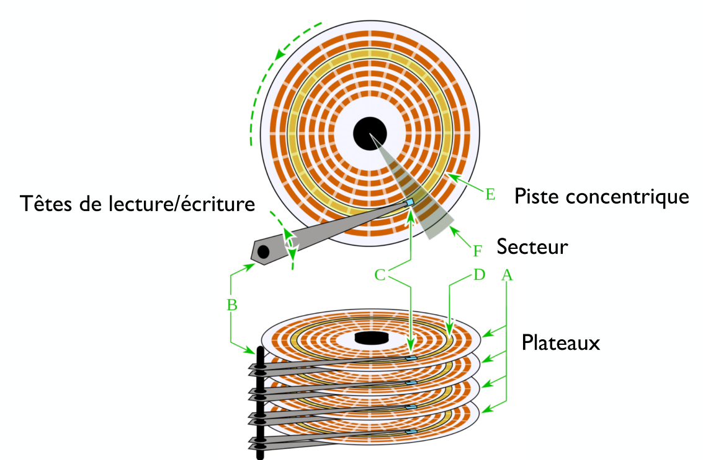
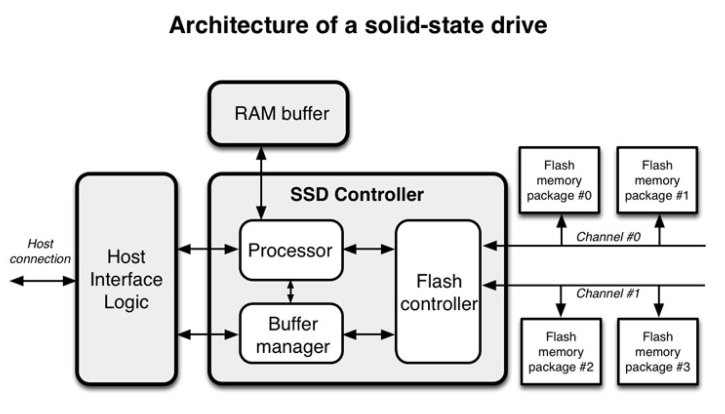
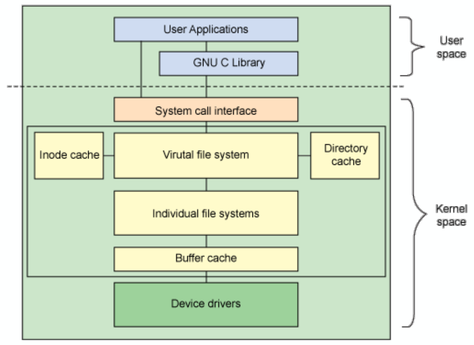
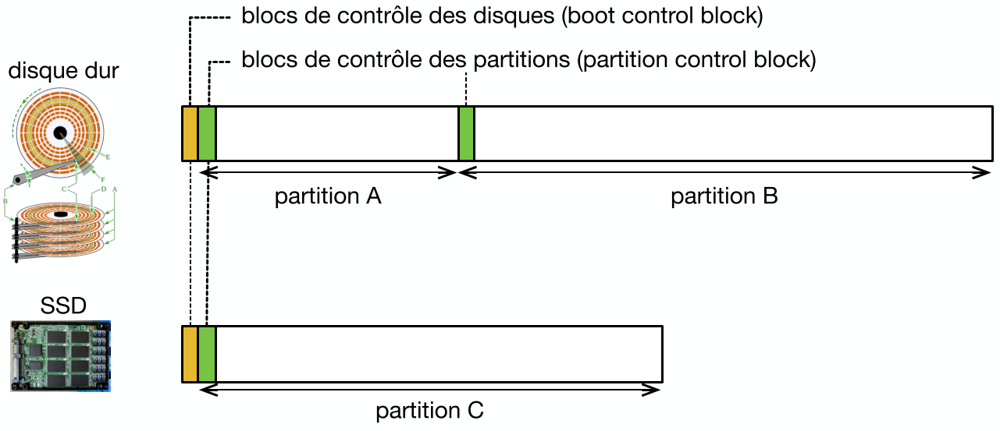
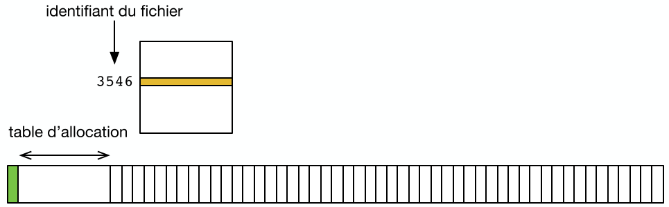
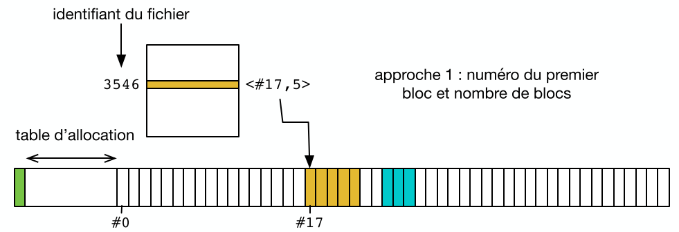
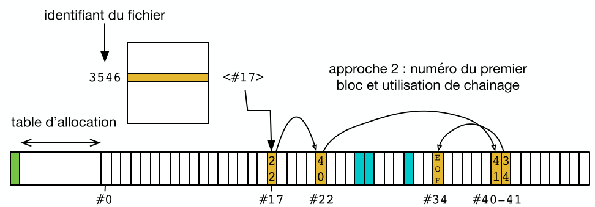
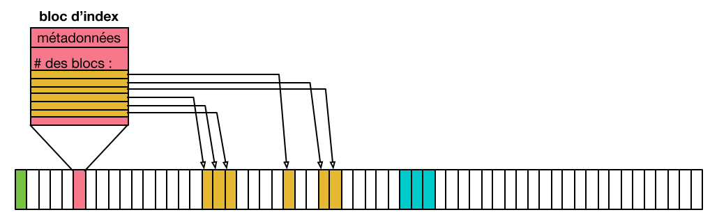

[↰](../README.md)

___

# Cours 12

- [Cours 12](#cours-12)
  - [Rappels](#rappels)
  - [Abstraction du Matériel](#abstraction-du-matériel)
    - [Les partitions](#les-partitions)
- [Structure d'un Système de Fichier](#structure-dun-système-de-fichier)
  - [Stockage et Allocation des Blocs](#stockage-et-allocation-des-blocs)
    - [Option 1](#option-1)
    - [Option 2](#option-2)
    - [FAT32](#fat32)
    - [Stockage indexé](#stockage-indexé)
    - [Système de Fichiers `ext4`](#système-de-fichiers-ext4)

## Rappels

Le *système de fichier* est une interface *unifiée* et unique des différents périphériques de stockage (car bcp de type différent). On a une hiérarchie en **point de montage** (`mnt`)

On a une grande diversité des supports:
1. Les Disques Durs avec des têtes de lectures basé sur les champs électro-magnétique

2. SSD: plus compliqué avec du flash, de la RAM buffer, ...

## Abstraction du Matériel

On a néanmoins une abstraction du matériel à faire pour que tout fonctionne de manière uniforme:

Le fait qu'un dispositif de stockage utilise des plateaux, ram, ... est géré via les *devices drivers* et le *gestionnaire de périphérique* (interface logiciel kernel/matériel).

Comme précédemment, on va gérer le stockage via des blocs de `4 Ko` (même taille qu'un page mémoire wow). On peut tout de même avoir une **granularité** différente (typiquement: `512` octets pour un HDD et entre `256` et `4096` octets pour un SSD).

### Les partitions

C'est le faite de virtuellement segmenter un support de stockage en multiples morceaux. 

On va retrouver au début des disques des **`boot control block`** et dans chaque début de **partitions** des **`partition control block`**.

#### `boot control block`

C'est là où est stocké le GRUB, c'est la première chose lue au démarrage ! (*cela contient des programmes de bootstrap*).

Il contient aussi des infos sur la taille des partitions et sur les **secteurs défectueux**.

#### `partition control block`

Dépend du système d'exploitation (NTFS, FAT32, ...). On a des infos utiles pour monter la partition. C'est le point de démarrage pour structurer un *système de fichier*.

Cela indique aussi si on a un démontage propre la dernière fois (*oui oui éjecter la clé USB là*).

#### Partition de `swap`

C'est là où on voit les *pages évincés par la mémoire virtuelle* (cf: cours 10).

On crée une telle partition via `mkswap` et on l'active via `swapon`.

C'est simplement un bloc de métadonnées et le reste est utilisé comme *cadre de page*. Les données ne doivent pas être persistante.

# Structure d'un Système de Fichier

Généralement on a des blocs de `4 Ko`. Donc un fichier occupe toujours un nombre entier de bloc (`100 o` fichier --> `4 Ko` sur disque). Donc on perd généralement de l'espace dans le dernier bloc.

On veut donc savoir quels blocs sont libres ou occupés, c'est un peu le même problème qu'avec ``malloc``. 

## Stockage et Allocation des Blocs

Donc après les différents blocs de contrôle, on va avoir une **table d'allocation**. La table est indexée par le *numéro du fichier*.

Chaque entrée contient les métadonnées (permission, propriétaire, ...) et permet d'accéder à la liste des blocs donnés.

Mais on doit s'intéresser à comment stocker un fichier et si sa taille venait à changer.

### Option 1

On écrit simplement les blocs les un à la suite de l'autre et on stocke simplement le pointeur vers l'entrée du premier blocs.

- [x] Simple
- [ ] Compliqué d'agrandir un fichier
- [ ] Fragmentation --> on a plein de blocs vides entre les blocs alloués

### Option 2

On stocke l'entrée pour le premier bloc puis on fait des pointeurs vers le suivant etc etc ou avec un `EOF` (End Of File) si plus rien.

- [x] N'empêche pas de réserver tout l'espace libre
- [ ] Localité HORRIBLE (le pire c'est sur un HDD)
- [ ] On doit parcourir le fichier pour accéder au milieu

### FAT32

Pour **File Allocation Table** utilisé sur MS-DOS et Windows (standard sur clé USB).

#### Combine 2 approches

On a une allocation des blocs *contiguës* et liste chainé entre *groupe de blocs*. Croissance possible sans déplacement de blocs.

- [x] Simple
- [ ] Grande fragmentation et perte de la localité avec le temps

#### (Dé)Fragmentation

Une solution à ce problème est de **défragmenter** son disque.

Très important sur HDD, pas nécessaire sur Linux via `ext4` qui prend des mesures en amont.

### Stockage indexé

On ne va plus utiliser une table de en début de partition mais on va utiliser certains blocs (**bloc d'index**) pour stocker les métadonnées.

- [x] Pas de limitation à l'avance du nombre de fichiers.
- [ ] On a besoin de 1 bloc en plus même pour des petits fichiers.

On peut utiliser tout l'espace mais on fait face à un risque d'*éparpillement*.

La taille du fichier est limité par la taille du bloc d'index. --> si on a `4 Ko` avec `4 o` par entrée cela signifie qu'on peut avoir que `800` entrées donc la taille maximum est de `4 Ko x 800` ~ `3 Mo`.

### Système de Fichiers `ext4`

TODO

___

[↰](../README.md)