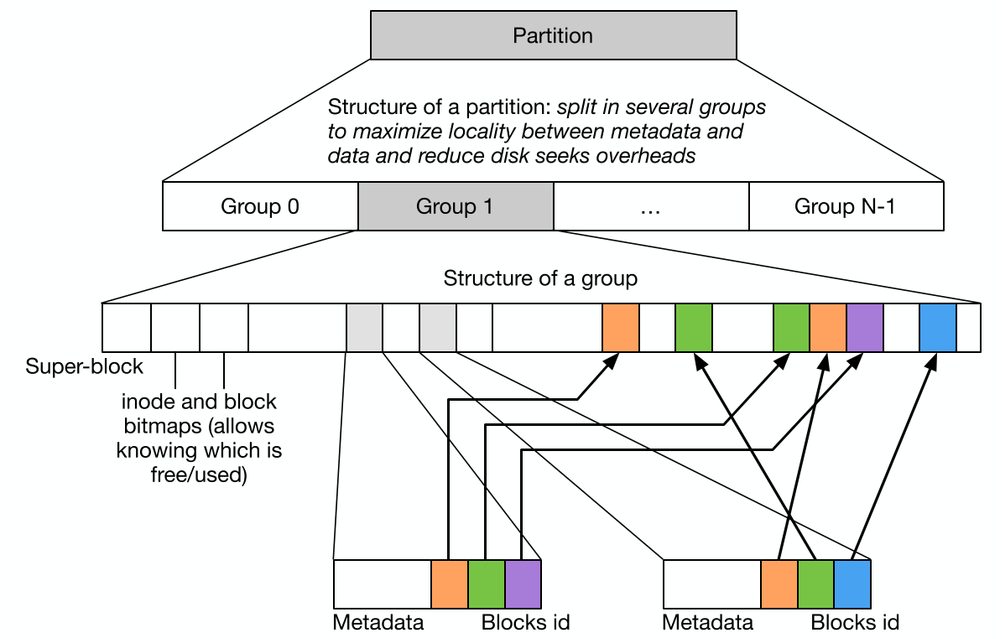
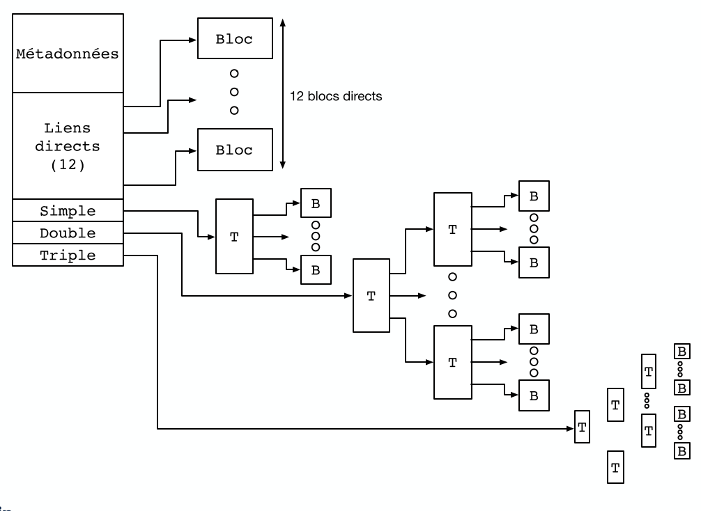
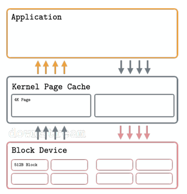
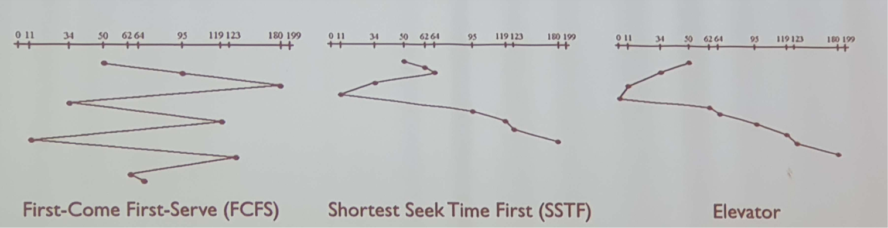

# Cours 12

## Rappels

Le *système de fichier* est une interface *unifiée* et unique des différents périphériques de stockage (car bcp de type différent). On a une hiérarchie en **point de montage** (`mnt`)

On a une grande diversité des supports:

1. Les Disques Durs avec des têtes de lectures basé sur les champs électro-magnétique

2. SSD: plus compliqué avec du flash, de la RAM buffer, ...

## Abstraction du Matériel

On a néanmoins une abstraction du matériel à faire pour que tout fonctionne de manière uniforme:

Le fait qu'un dispositif de stockage utilise des plateaux, ram, ... est géré via les *devices drivers* et le *gestionnaire de périphérique* (interface logiciel kernel/matériel).

Comme précédemment, on va gérer le stockage via des blocs de `4 Ko` (même taille qu'un page mémoire wow). On peut tout de même avoir une **granularité** différente (typiquement: `512` octets pour un HDD et entre `256` et `4096` octets pour un SSD).

### Les partitions

C'est le faite de virtuellement segmenter un support de stockage en multiples morceaux. 

On va retrouver au début des disques des **`boot control block`** et dans chaque début de **partitions** des **`partition control block`**.

#### `boot control block`

C'est là où est stocké le GRUB, c'est la première chose lue au démarrage ! (*cela contient des programmes de bootstrap*).

Il contient aussi des infos sur la taille des partitions et sur les **secteurs défectueux**.

#### `partition control block`

Dépend du système d'exploitation (NTFS, FAT32, ...). On a des infos utiles pour monter la partition. C'est le point de démarrage pour structurer un *système de fichier*.

Cela indique aussi si on a un démontage propre la dernière fois (*oui oui éjecter la clé USB là*).

#### Partition de `swap`

C'est là où on voit les *pages évincés par la mémoire virtuelle* (cf: cours 10).

On crée une telle partition via `mkswap` et on l'active via `swapon`.

C'est simplement un bloc de métadonnées et le reste est utilisé comme *cadre de page*. Les données ne doivent pas être persistante.

# Structure d'un Système de Fichier

Généralement on a des blocs de `4 Ko`. Donc un fichier occupe toujours un nombre entier de bloc (`100 o` fichier --> `4 Ko` sur disque). Donc on perd généralement de l'espace dans le dernier bloc.

On veut donc savoir quels blocs sont libres ou occupés, c'est un peu le même problème qu'avec ``malloc``. 

## Stockage et Allocation des Blocs

Donc après les différents blocs de contrôle, on va avoir une **table d'allocation**. La table est indexée par le *numéro du fichier*.

Chaque entrée contient les métadonnées (permission, propriétaire, ...) et permet d'accéder à la liste des blocs donnés.

Mais on doit s'intéresser à comment stocker un fichier et si sa taille venait à changer.

### Option 1

On écrit simplement les blocs les un à la suite de l'autre et on stocke simplement le pointeur vers l'entrée du premier blocs.

- ✅ Simple
- ❌ Compliqué d'agrandir un fichier
- ❌ Fragmentation --> on a plein de blocs vides entre les blocs alloués

### Option 2

On stocke l'entrée pour le premier bloc puis on fait des pointeurs vers le suivant etc etc ou avec un `EOF` (End Of File) si plus rien.

- ✅ N'empêche pas de réserver tout l'espace libre
- ❌ Localité HORRIBLE (le pire c'est sur un HDD)
- ❌ On doit parcourir le fichier pour accéder au milieu

### FAT32

Pour **File Allocation Table** utilisé sur MS-DOS et Windows (standard sur clé USB).

#### Combine 2 approches

On a une allocation des blocs *contiguës* et liste chainé entre *groupe de blocs*. Croissance possible sans déplacement de blocs.

- ✅ Simple
- ❌ Grande fragmentation et perte de la localité avec le temps

#### (Dé)Fragmentation

Une solution à ce problème est de **défragmenter** son disque.

Très important sur HDD, pas nécessaire sur Linux via `ext4` qui prend des mesures en amont.

### Stockage indexé

On ne va plus utiliser une table de en début de partition mais on va utiliser certains blocs (**bloc d'index**) pour stocker les métadonnées.

- ✅ Pas de limitation à l'avance du nombre de fichiers.
- ❌ On a besoin de 1 bloc en plus même pour des petits fichiers.

On peut utiliser tout l'espace mais on fait face à un risque d'*éparpillement*.

La taille du fichier est limité par la taille du bloc d'index. --> si on a `4 Ko` avec `4 o` par entrée cela signifie qu'on peut avoir que `800` entrées donc la taille maximum est de `4 Ko x 800` ~ `3 Mo`.

### Système de Fichiers `ext4`

C'est le système de fichier standard et très généraliste et opti.

Mélange entre table d'allocation et blocs d'index. On a des *inodes* qui contient des métadonées et liens vers les blocs de contenu. 

Les inodes peuvent être inférieures à `4 Ko`. Cela favorise la localité des informations.

L'idée c'est de faire des arbres d'inodes, donc on peut avoir des arbres triples, doubles, simples , ...

## Stockage des Répertoires

Un répertoire est stocké comme un fichier. On va juste indiquer qu'il s'agit d'un répertoire via des métadonnées via un bit `d`. On y liste aussi les blocs de données (peut utiliser plusieurs blocs de données).

Via `ext4`, stockage de petite liste de fichiers directement dans l'inode.

## Gestion de l'Espace Libre

On a une liste qui indique les blocs libres sur le disque qui est conservée avec le temps.

### Effacer un Fichier

`rm` va juste supprimer l'entrée dans le répertoire et mettre dans celle des blocs libres si plus aucun lien ne pointe vers ce fichier.

L'inode et le bloc **ne sont pas effacés**. (donc on peut récupérer des données même si elles ont été "*effacées*")

### Performance et Cache

Un SSD est 1000 fois plus lent que de la RAM et un HDD est 1000000 de fois plus lent. On va donc utiliser du cache.

Le cache se situe au niveau du **contrôleur de périphérique et/ou du disque**.

On peut utiliser la mémoire comme cache pour les accès disque. On peut faire cela via la mémoire virtuelle et `mmap`.

## Optimisations

#### Disque Dur

On va éviter de faire trop bouger la tête de lecture, donc on écrit sur la partie la plus extérieure du disque.

On a un accès souvent séquentiel aux fichiers donc pas de retour en arrière, on lit tout d'une traite:

- *read-ahead*: on charge les blocs suivants
- *read-behind*: on libère les pages du cache au fur et à mesure.

On va éviter les approches FIFO et privilégier soit une approche SSTF où on se déplace du moins possible ou changer de direction le moins possible via un algorithme de l'ascenseur.

### Robustesse

Il faut que les données du disque restent cohérente malgré les mauvais démontage, ...

On va donc avoir de la redondance et des vérificateurs de fichiers. On peut vérifier que la liste des blocs vides ne pointent pas vers un bloc listé par une inode.

#### Journalisation

On y écrit dedans toutes les transactions effectuées afin de pouvoir voir à quel endroit cela a causé un soucis. Le journal est performant car écriture locale et contiguë.

