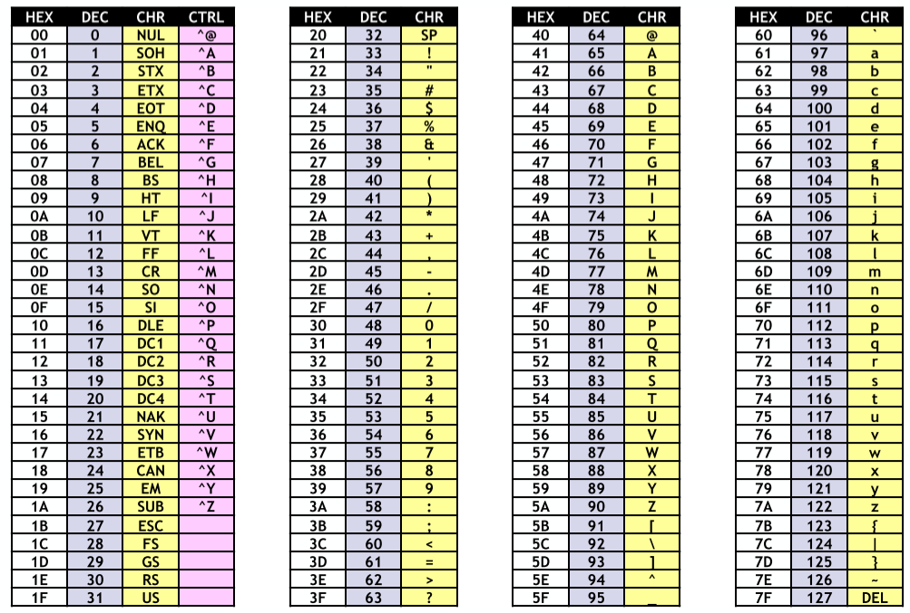

# Rappels & compléments de C

- [Rappels \& compléments de C](#rappels--compléments-de-c)
  - [Les bases](#les-bases)
    - [Hello world](#hello-world)
    - [Préprocesseur](#préprocesseur)
    - [Types de variables](#types-de-variables)
    - [Tableaux](#tableaux)
    - [Caractères ASCII](#caractères-ascii)
    - [Les pointeurs](#les-pointeurs)
    - [Structures](#structures)
    - [Pointeur vers une fonction](#pointeur-vers-une-fonction)
    - [Expressions de manipulation de bits](#expressions-de-manipulation-de-bits)
    - [Constante](#constante)


## Les bases

### Hello world

On se souvient que pour faire un programme en C il faut des choses cruciales:
1. Directives préprocesseur `#include <stdio.h>`
2. Avoir une fonction `main` qui est le point d'entrée de l'exécution
   1. Fournir les arguments `argc` et `argv[]` pour prendre les arguments en ligne de commande.
3. Retourner un succès avec `EXIT_SUCCESS`
4. Compiler le programme avec `gcc` comme cela `gcc -o output input.c`

```C
#include <stdio.h>
#include <stdlib.h>

int main(int argc, char* argv[]){
    printf("Hello world !\n");

    return EXIT_SUCCESS;
}
```

### Préprocesseur

Notre code C est transformé par ce préprocesseur avant d'être compilé en langage machine.

C'est donc une traduction texte vers texte. 

Pour obtenir le résultat du préprocesseur on fait `gcc -E`.

#### Include et header

Cela permet d'importer des fonctions, constantes d'un librairie. 

- **Header**: contient les informations sur comment appeler une fonction et le squelette du code.
- **Code source**: la mise en oeuvre des fonctions.

On fait `#include "monheader.h"` pour inclure du dossier courant et `#include <header.h>` pour un header standard. On peut avoir des infos sur un header via `man 3 stdio.h`.

### Types de variables

Voir les slides car très basique

Il faut faire attention en C avec les notations des `int`:
- Notation classique: `i = 123`
- Hexadécimal: `i = 0x7b`
- Octal: `i = 0173`
- Binaire: `i = 0b1111011`

La différence entre octal et classique est ce 0 au début.

On se souvient aussi des entiers *unsigned* qui sont des entiers qui ne peuvent être négatifs et donc pour le même nombre de bit peuvent avoir un nombre plus élevé que leurs homologues *signed*.

### Tableaux

On se souvient qu'en C, la taille d'un array doit être connu à l'avance ! (sinon on doit utiliser malloc sur le heap)

### Caractères ASCII




### Les pointeurs

La mémoire est une sorte de ruban avec des cases (*octets*) avec des adresses consécutives. Les adresses sont des **entiers non signés** de **32/64** bits selon le processeur ou jeu d'instruction.

Pour définir une variable d'un pointeur on fait:

```C
int* ptr_i; // Défini un pointeur d'un int
&ptr_i; // Permet d'avoir l'adresse où est stocké ce pointeur
*ptr_i; // Pour avoir la valeur pointée par le pointeur
```

On n'oublie pas qu'on peut faire des **opérations arithmétiques** sur les pointeurs. (ex: aller à la case suivante, ...)

```C
int main(int argc, char **argv) { 
    
    char **p; p=argv; 
    printf("Arguments :"); 
    while(*p!=NULL) { 
        printf(" %s",*p); 
        p++;
    }
    printf("\n");
    return(EXIT_SUCCESS);
}
```

Ici, on voit que à un moment donné, le pointeur sera `NULL` car il n'y a plus de zone mémoire.


### Structures

On n'a pas la notion d'objet en C mais on peut déclarer des types de données personnalisées sous forme de structure.

```C
struct coord{
    int x;
    int y;
    int z;
}

struct coord point = {1, 2, 3};
point.x; point.y; point.z;
```

#### Alias

Pour simplifier l'écriture de structure, on peut utiliser des **alias**. On peut même renommer des types de données déjà existant (ex: int, ...):


```C
// structure pour stocker une fraction 
typedef struct fraction { 
    double numerator; 
    double denominator; 
} Fraction ;

typedef int Entier;

int main(int argc, char *argv[]) {
    Fraction demi = {1, 2}; 
    Entier i = 2; 
    // ... 
    return EXIT_SUCCESS;
}
```

#### Tips

Il existe un sucre syntaxique vraiment sympa:

```c
(*f).value;
f->value;
```

Cela fait la même chose mais est plus simple (surtout avec les parenthèses).


### Pointeur vers une fonction

On peut stocker une fonction via son pointeur comme cela:

```C
type_retour (*ptr_vers_func)([type_arg]+);
void (*f1)(int, int, char*);
int (*f2)(int);
f2 = &ma_function;
```

Ensuite pour faire un appel, on doit déréférencer le pointeur.

### Expressions de manipulation de bits

| Opération |                Explication                |
| :-------: | :---------------------------------------: |
|    `~`    |            Inversion des bits             |
|    `&`    |                   Le ET                   |
|   `\|`    |                   le OU                   |
|    `^`    |     le XOR (seulement si 1 bit est 1)     |
|   `>>`    | Shift les bits de x places vers la droite |

### Constante

Pour définir une constante:
- **Avant C99**: `#define M_PI` puis mettre `3.14159;`
- **Après C99**: On utilise le mot-clé `const`.

Une variable globale est définie pour tous les modules d'un programme.

Une variable `static`, on peut y accéder en dehors d'un bloc de fonction car on ne doit pas l'instancier.


