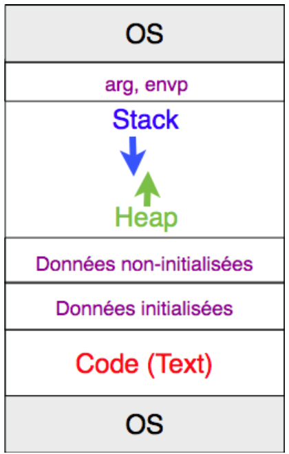
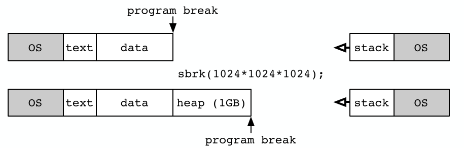

[<--](../README.md)

___

# Cours 3

## Déclaration de la mémoire

Exécuter un programme sous Unix c'est créé un *nouveau processus* + *nouvel espace mémoire spécifique* au processus.



On a donc 6 segments distincts.

|                  Zone                  |                                                                                                Description                                                                                                |
| :------------------------------------: | :-------------------------------------------------------------------------------------------------------------------------------------------------------------------------------------------------------: |
|                   OS                   |                                                                                              Réservé à l'OS                                                                                               |
|              Segment text              |                                partie la plus basse, en read only. Contient les instructions à exécuter. Écrire dessus va déclencher un *trap* et le SE prend le contrôle                                 |
|        *Statique*: initialisée         |                                                   (statique correspond à des données connues avant l'exécution). Explicitement initialisée ou statique                                                    |
|      *Statique*: non-initialisée       |                                                                                       mise à 0 par le compilateur.                                                                                        |
|                  Heap                  |                                  juste après les non-init. Un programme peut y réserver de la mémoire dessus. On reçoit un pointeur vers le début de la zone. (`malloc`)                                  |
|                 Stack                  |                    Démarre vers le haut de l'espace mémoire. Cela stocke les variables **locales** et permet l'appel de fonction. (paramètre d'appel, valeur de retour) et c'est LIFO.                    |
| Arguments et varaibles d'environnement | Tout d'au-dessus, on a les données fournies par le SE en lecture seule. Typiquement les données qu'on passe quand on lance un programme + variable d'environnement (`getenv`, `unsetenv`, `setenv`, ...). |

Il faut savoir que les variables locales non initialisées **ne sont pas mises à 0**. Donc attention au garbage data !

## Gestion de la mémoire dynamique

L'allocation de mémoire dynamique est une partie de la librairie standard. On peut parfois faire des appels systèmes pour étendre la zone mémoire liée au heap.



On voit que `sbrk` réalise un élargissement de la zone de heap.

```c
#include <unistd.h> 

int brk(void *addr);            // Positionne le programme break a une adresse
void *sbrk(intptr_t increment); // Décale le programme break et retourne le nouveau program break. (sbrk(0) retourne la valeur actuelle donc)
```

Attention à ne pas trop incrémenter sous peine de cause une erreur. --> `ENOMEM` et le processus sera arrêté par le SE. La limite se trouve via `ulimit -a`.

### Allouer de la mémoire

On a différentes contraintes:
- Conserver l'information sur les blocs libres et allouées (via méta-données)
- méta-données dans le heap
- Trouver le bon endroit pour les mettre

#### Alignement

Les données dans la mémoire sont toutes **alignées**. Souvent sous un nombre d'octets entiers --> multiple de 2. Sous linux c'est 16 octets (128bits). 

Donc allouer 17 octets va en réalité nous couter 32 octets. 

L'utilité principale (comme vu dans le projet) est que les bits de poids faibles seront toujours à 0. (effectivement `0b00000000` --> `0b00010000` --> `0b00100000` --> ...). Ainsi, on peut prendre avatange de ces 4 bits toujours mis à 0 en les utilisant comme des méta-données.

#### Objectifs

___

[<--](../README.md)