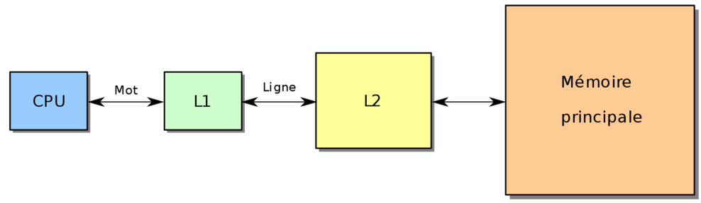
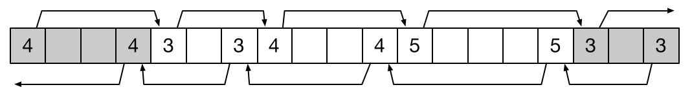
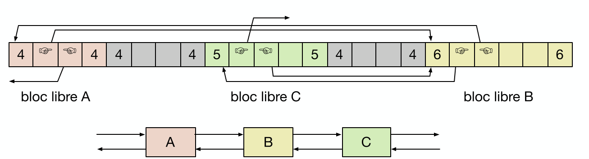

[<--](../README.md)

___

# Cours 3

## Déclaration de la mémoire

Exécuter un programme sous Unix c'est créé un *nouveau processus* + *nouvel espace mémoire spécifique* au processus.


On a donc 6 segments distincts.

|                  Zone                  |                                                                                                Description                                                                                                |
| :------------------------------------: | :-------------------------------------------------------------------------------------------------------------------------------------------------------------------------------------------------------: |
|                   OS                   |                                                                                              Réservé à l'OS                                                                                               |
|              Segment text              |                                partie la plus basse, en read only. Contient les instructions à exécuter. Écrire dessus va déclencher un *trap* et le SE prend le contrôle                                 |
|        *Statique*: initialisée         |                                                   (statique correspond à des données connues avant l'exécution). Explicitement initialisée ou statique                                                    |
|      *Statique*: non-initialisée       |                                                                                       mise à 0 par le compilateur.                                                                                        |
|                  Heap                  |                                  juste après les non-init. Un programme peut y réserver de la mémoire dessus. On reçoit un pointeur vers le début de la zone. (`malloc`)                                  |
|                 Stack                  |                    Démarre vers le haut de l'espace mémoire. Cela stocke les variables **locales** et permet l'appel de fonction. (paramètre d'appel, valeur de retour) et c'est LIFO.                    |
| Arguments et varaibles d'environnement | Tout d'au-dessus, on a les données fournies par le SE en lecture seule. Typiquement les données qu'on passe quand on lance un programme + variable d'environnement (`getenv`, `unsetenv`, `setenv`, ...). |

Il faut savoir que les variables locales non initialisées **ne sont pas mises à 0**. Donc attention au garbage data !

## Gestion de la mémoire dynamique

L'allocation de mémoire dynamique est une partie de la librairie standard. On peut parfois faire des appels systèmes pour étendre la zone mémoire liée au heap.


On voit que `sbrk` réalise un élargissement de la zone de heap.

```c
#include <unistd.h> 

int brk(void *addr);            // Positionne le programme break a une adresse
void *sbrk(intptr_t increment); // Décale le programme break et retourne le nouveau program break. (sbrk(0) retourne la valeur actuelle donc)
```

Attention à ne pas trop incrémenter sous peine de cause une erreur. --> `ENOMEM` et le processus sera arrêté par le SE. La limite se trouve via `ulimit -a`.

### Allouer de la mémoire

On a différentes contraintes:
- Conserver l'information sur les blocs libres et allouées (via méta-données)
- méta-données dans le heap
- Trouver le bon endroit pour les mettre

#### Alignement

Les données dans la mémoire sont toutes **alignées**. Souvent sous un nombre d'octets entiers --> multiple de 2. Sous linux c'est 16 octets (128bits). 

Donc allouer 17 octets va en réalité nous couter 32 octets. 

L'utilité principale (comme vu dans le projet) est que les bits de poids faibles seront toujours à 0. (effectivement `0x00000000` --> `0x00010000` --> `0x00100000` --> ...). Ainsi, on peut prendre avatange de ces 4 bits toujours mis à 0 en les utilisant comme des méta-données.

#### Objectifs

3 critères pour un bon algorithme de mémoire dynamique:
1. Temps d'exécution faible, stable
2. Peu de fragmentation (avoir des trous vides)
3. Bonne localité (garder les données proches l'une des autres)

Fragmentation: interne si espace perdu à cause du padding, externe si manque de place et blocs vides.

### Principe de cache



Pas d'accès à la mémoire cache car trop lente. Au plus elle est rapide au plus elle coute chère. On a une granularité du cache qui est de 64 octets, cela veut dire qu'on lit à chaque fois 64 octets.

#### Localité

Le cache joue sur la localité:

- *Localité Spatiale*: accès à une donné suivie d'accès contiguës.
- *Localité Temporelle*: une donnée récemment lue est souvent dans le cache

### Implémentation de Notre Malloc

On stocke dans 1 bloc de métadonnées la taille de bloc qui est libre + 1 (pour le bloc de métadonnées) et dans le bit de poids faible le drapeau si c'est alloué ou pas.

C'est pour ça qu'on alloue de minimum 2 comme ça le dernier bit peut être comme un flag. On peut l'isoler en utilisant des masques `c & 0x1`.

On peut facilement scinder des blocs en deux etc.

#### Free

Rien de plus simple, on change le drapeau du bit de poids faible à 0. On évite de checker si l'utilisateur nous renvoie un bon pointeur car coûte $O(n)$.

Mais faire cela va fragmenter notre mémoire, on va généralement fusionner le nouveau bloc libre avec les blocs libres immédiatement à gauche et à droite. Mais on a besoin d'une approche **double linkedlist** pour ça.



#### Politique

First fit:
- [x] Rapide car trouve le premier bloc libre
- [ ] Fragmentation
- [ ] Localité faible et devient de pire en pire

Next fit (un first fit qui commence au dernier bloc alloué):
- [x] Rapide
- [ ] Fragmentation de fou furieux
- [x] Bonne localité

Best fit (parcours la liste pour trouver le bloc le plus petit possible pour notre nouvelle donnée):
- [ ] Lenttttt
- [x] Fragmentation minime
- [ ] Localité pas ouf

### Approche par List Explicite

On lit les blocs vides entre eux ! Le premier bloc vide sera la taille de l'ensemble et son second indiquera le prochain bloc vide. On peut combiner cela à une approche doublement chaînée.



On doit donc gérer les insertions et suppressions de blocs. 2 solutions:
1. Insérer en fonction de l'adresse: nous coûte cher car on doit tout parcourir mais simple à fusionner
2. LIFO: on supprime au bout (facile) mais fusion plus compliquée.

On peut aussi voir une approche différente où on a plusieurs listes en fonction de la taille de bloc disponible mais ça devient très couteux et de plus en plus cher.

Tout est une question de compromis comme toujours.


___

[<--](../README.md)