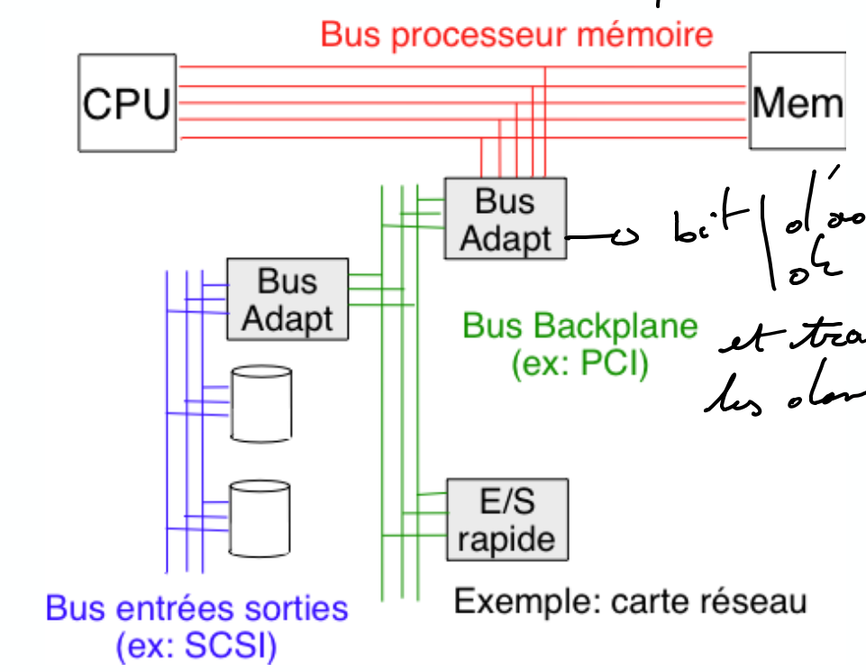
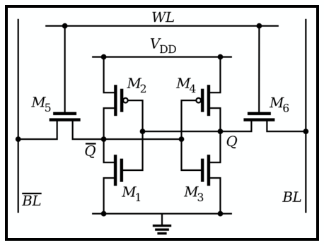

# Cours 4

- [Cours 4](#cours-4)
  - [Rappel](#rappel)
    - [Neumann](#neumann)
  - [Mémoire](#mémoire)
    - [Instructions et Registres](#instructions-et-registres)
    - [Architecture](#architecture)
    - [Technologies mémoires](#technologies-mémoires)

## Rappel

### Neumann

On se souvient de la structure de Neumann où on va stocker en mémoire **les instructions et les données**.

Ceci est composé d'un CPU qui a lui même:
- **Unité arithmétique et logique**: Opérateurs matériel pour les opérations *arithmétiques* (`+,-,...`) et *logiques* (`&,|,^,...`).
- **Unité de commande**: Met en oeuvre le cycle *fetch/decode/execute* des instructions depuis la mémoire.

## Mémoire

On l'organise en octet d'adresses consécutives. $2^k$ octets donne le nombre d'adresse mémoire possible sur $k$ bits. Avec $k=32$ on a une taille de mémoire de maximum 4GO contre 16 Exa-octets pour $k=64$.

### Instructions et Registres

On code les instructions en binaires. Les instructions sont de tailles fixes ou variables. 

Un processeur possède un **nombre limité de zone mémoire** appelés **registres**. C'est directement accessible par les instructions et en tandem avec la mémoire principale.

### Architecture

### Technologies mémoires

On a la **SRAM** (statique) et la **DRAM** (dynamique). La SRAM est plus couteuse mais plus rapide. On va les utiliser en tandem pour ne pas être ralenti par notre mémoire.

En effet, les cycles de CPU sont devenus extrêment cours. Encore plus cours que ceux de la mémoire. C'est-à-dire on perdrait ce gain de vitesse si on utilisait pas de la DRAM car on devrait attendre pour plusieurs cycles avant d'avoir l'information.

Ces deux technologies sont dites **volatiles**. Quand plus de jus c'est mort.

#### SRAM

On a donc de multiples bascules (6 transistor par bit (ou 4 + des resistances)). On lit la valeur en fonction du passage ou non du courant.