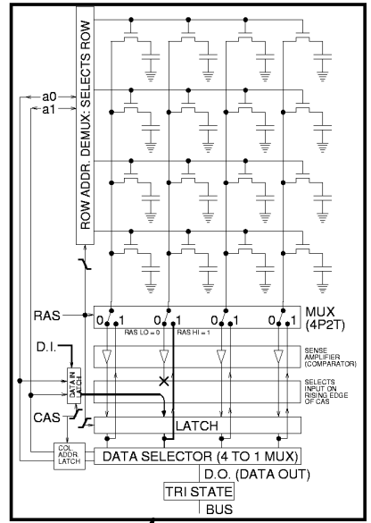
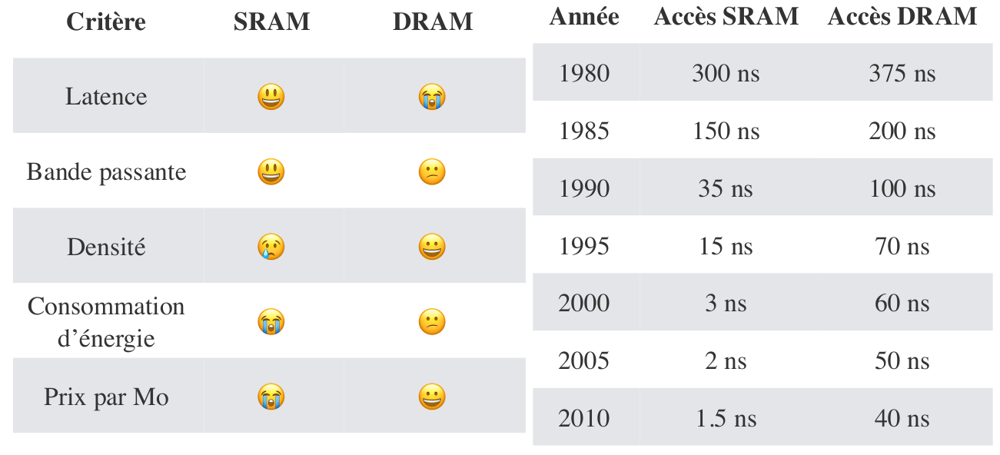
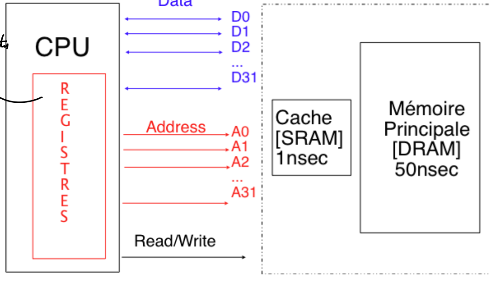

# Cours 4


## Rappel

### Neumann

On se souvient de la structure de Neumann où on va stocker en mémoire **les instructions et les données**.

Ceci est composé d'un CPU qui a lui même:
- **Unité arithmétique et logique**: Opérateurs matériel pour les opérations *arithmétiques* (`+,-,...`) et *logiques* (`&,|,^,...`).
- **Unité de commande**: Met en oeuvre le cycle *fetch/decode/execute* des instructions depuis la mémoire.


## Mémoire

On l'organise en octet d'adresses consécutives. $2^k$ octets donne le nombre d'adresse mémoire possible sur $k$ bits. Avec $k=32$ on a une taille de mémoire de maximum 4GO contre 16 Exa-octets pour $k=64$.

### Instructions et Registres

On code les instructions en binaires. Les instructions sont de tailles fixes ou variables. 

Un processeur possède un **nombre limité de zone mémoire** appelés **registres**. C'est directement accessible par les instructions et en tandem avec la mémoire principale.

### Architecture


### Technologies mémoires

On a la **SRAM** (statique) et la **DRAM** (dynamique). La SRAM est plus couteuse mais plus rapide. On va les utiliser en tandem pour ne pas être ralenti par notre mémoire.

En effet, les cycles de CPU sont devenus extrêment cours. Encore plus cours que ceux de la mémoire. C'est-à-dire on perdrait ce gain de vitesse si on utilisait pas de la DRAM car on devrait attendre pour plusieurs cycles avant d'avoir l'information.

Ces deux technologies sont dites **volatiles**. Quand plus de jus c'est mort.

#### SRAM


On a donc de multiples bascules (6 transistor par bit (ou 4 + des resistances)). On lit la valeur en fonction du passage ou non du courant.

#### DRAM

On stocke l'information dans des condensateurs



La lecture des bits se fait sous forme de matrice donc si on veut lire une valeur, on lit en réalité toute la ligne. Donc le temps pour lire 1 valeur et 64 est la même.



On doit donc combiner un peu de SRAM coûteuse avec de la DRAM peu chère. On utilise la SRAM comme cache.

### Cache

Le cache interagit directement avec le Cache. On y conserve les données récemment accédées.

### Localité

#### Temporelle

On peut accéder à la même donnée se trouvant au même endroit, on va souvent repasser dessus.

#### Localité

On va passer sur toutes les adresses car nos données sont juxtaposé.

### Hiérarchie




### Fonctionnement d'un cache

#### Lecture

On va lire l'octet à une adresse spécifique. Si cette adresse se trouve déjà en cache on va lire l'adresse depuis le cache.

Sinon, la mémoire cache va récupérer une copie de la mémoire à cette adresse. On a donc toute la granularité donc 64 octets ! On sauvegarde le tout dans le cache.

#### Écriture

Si on veut écrire `A`, on va regarder si on a l'adresse de destination en cache. On écrit directement dans le cache ou bien on doit récupérer depuis la mémoire.

1. **Write through**: écriture immédiate.
2. **Write back**: on écrit au moment où la ligne de cache est retiré du cache.

#### Réalité

On a dans un processeur 3 niveaux de caches : `L1, L2, L3`

## Jeu d'instructions IA 32

Ce jeu d'instructions est 32 bits ! (donc max 4 Go de mémoire).

### Registres

On a 8 registres génériques de **32 bits**:
- `EAX`
- `EBX`
- `ECX`
- `EDX`
- `ESI`
- `EDI`
- `EBP`: gère la pile
- `ESP`: gère la pile

On a 1 registres qui stocke le compteur de programme:
- `EIP`

On a également des registres pour traiter les floats et double.

### Types de données

|    Type    | Taille (octets) | Suffixe assembleur |
| :--------: | :-------------: | :----------------: |
|   `char`   |        1        |         b          |
|  `short`   |        2        |         w          |
|   `int`    |        4        |         l          |
| `long int` |        4        |         l          |
|  `void *`  |        4        |         l          |

### Instructions

|    Fonctions     |  Variantes  |                          Explications                          |
| :--------------: | :---------: | :------------------------------------------------------------: |
|      `mov`       |   `movb`    |  `movb src, dest`: déplace de `src` vers `dest` pour taille 1  |
|                  |   `movw`    |  `movb src, dest`: déplace de `src` vers `dest` pour taille 2  |
|                  |   `movl`    |  `movb src, dest`: déplace de `src` vers `dest` pour taille 4  |
|      `inc`       | `b`,`w`,`l` |                      Incrémente la valeur                      |
|      `dec`       | `b`,`w`,`l` |                      Décrémente la valeur                      |
|      `not`       | `b`,`w`,`l` |                            Négation                            |
|      `add`       | `b`,`w`,`l` |          `add addition, dest`: ajoute à dest addition          |
|      `sub`       | `b`,`w`,`l` |    `sub soustraction, dest`: soustrait à dest soustraction     |
|      `mul`       | `b`,`w`,`l` | Même chose que pour sub et add, `imul` pour les nombres signés |
|      `div`       | `b`,`w`,`l` |                 Division d'entiers non-signés                  |
|  `shl` \& `shr`  | `b`,`w`,`l` |      Shift vers la gauche et la droite (utile en binaire)      |
| `or`/`xor`/`and` | `b`,`w`,`l` |      Opération logique binaires avec résultat dans `dist`      |


### Modes d'adressage

Pour spécifier un registre, on utilise `%eax` pour spécifier le registre `EAX`. Pour écrire une valeur dans un registre, on fait `$123` pour écrire `123`.

```assembly
movl $123, %eax ; écris dans le registre eax 
```


On peut faire une référence **absolue**. C'est-à-dire faire `movl 0x04, %eax` pour mettre dans `eax` la valeur se trouvant à l'adresse `0x04`.

On peut être **indirect**. On peut spécifier un registre qui contient une adresse.

```assembly
movl (%eax), %ecx   ; écris dans ecx ce qui se trouve dans le registre eax.
```

On peut faire de l'**indirect avec base et déplacement**. On accede à une adresse + ou - la valeur donnée. On fait `D(%reg)` qui permet de bouger l'adresse de D.

```assembly
movl $0x08, %eax    ; place la valeur 0x08 dans %eax
movl 0(%eax), %ecx  ; place la valeur (0xFF) se trouvant à l'adresse
                    ; 0x08= (0x08+0) dans le registre %ecx
movl 4(%eax), %ecx  ; place la valeur (0x10) se trouvant à l'adresse
                    ; 0x0C (0x08+4) dans le registre %ecx
movl -8(%eax), %ecx ; place la valeur (0x04) se trouvant à l'adresse
                    ; 0x00 (0x08-8) dans le registre %ecx
```

### Registre de drapeaux `eflags`

On a un registre spécial `eflags` qui contient des bits "drapeau" qui est mis à jour à l'exécution des instructions.

- **ZF**: indique si le résultat de la dernière opération est = à 0.
- **SF**: indique si le résultat de la dernière opération est < à 0.
- **CF**: indique si le résultat de la dernière opération arithmétique **non-signé** requiert plus de 32 bits.
- **OF**: indique si le résultat de la dernière opération arithmétique **signé** requiert plus de 32 bits.

Ce registre se met à jour mais certaines opérations ne vont pas stocker le résultat:
- `cmp`: équivalent de `sub`
- `test`: équivalent de `and`

Pour récupérer la valeur des drapeaux on utilise `set`.
- `sete`: **ZF**
- `sets`: **SF**
- `setg`: `~SF & ZF` en gérant dépassement test>
- `setl`: **SF** et gérant le dépassement test<=


#### Exemples

Jetez un œil au [syllabus](https://sites.uclouvain.be/SystInfo/notes/Theorie/Assembleur/memory.html).

### Saut

On va modifier la valeur du **compteur de programme** `%eip`.

#### Inconditionnel

On fait simplement `jmp [etiquette]`. On va donc sauter jusqu'à une étiquette. On peut aussi sauter à une adresse mémoire via `jmp *%eax` (saute à l'instruction se trouvant à l'adresse mémoire dans EAX). 

#### Conditionnel

La comparaison compare avec la dernière valeur en référence.

- `je`: Saut si égal
- `js`: Saut si négatif
- `jg`: Saut si strictement supérieur à 
- `jge`: Saut si supérieur ou égal à
- `jl`: Saut si strictement inférieur à 
- `jle`: Saut si inférieur ou égal à 

Pour les négations, on rajoute un `n` après `j`.

### Manipulation de la Pile

Comme dit plus haut, la pile est stocké dans le registre `%esp`.

#### Opérations

- `pushl %reg`: place le contenu `%reg` au somment de la pile. Décrémente la taille du registre `%esp` de 4.
- `popl %reg`: retire le mot de 32 bits du sommet de la pile et le place dans `%reg`. Incrémente la taille du registre `%esp` de 4.

### Fonctions

On a comme en Oz des procédures qui sont des fonctions sans valeur de retour.

#### Appel

1. Sauver l’adresse de l’instruction qui suit l’appel de fonction
2. Positionner le compteur de programme à la première instruction de la fonction appelée
3. Exécuter la fonction
4. Positionner le compteur de programme à l’adresse qui suit l’appel, précédemment sauvée

L'instruction `call` combine l'étape 1 et 2. `ret` réalise l'étape 4. À savoir que `call` et `ret` modifie la pile (donc `%esp`). 

```assembly
increase:     ; étiquette de la première instruction
            movl  g,  %eax
            addl  h,  %eax
            movl  %eax, g
            ret
init_g: 
            movl  $1252,  g
            ret
main: 
            (...)
            calll init_g
A_init_g:   calll increase
A_increase: movl  $0, %eax
            addl  $12, %esp
            ret
g:
      .long 0
h:
      .long 2
```

#### Avec Arguments

On place les arguments dans la pile. On passe donc les arguments par **valeur**. On met donc l'adresse de retour sur le sommet de la pile puis le premier, second, ...

Pour modifier les registres `%eax`, `%ecx` et `%edx`, il faut faire une copie de sauvegarde.

Pour modifier les registres `%ebx`, `%edi` et `%esi`, il faut copier puis restaurer. (qu'un convention)

#### Valeur de Retour

On stocke les valeurs de retour dans le registre `%eax` par convention.

