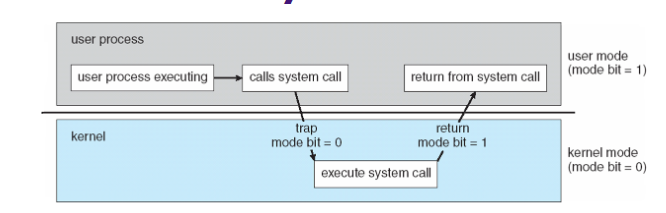
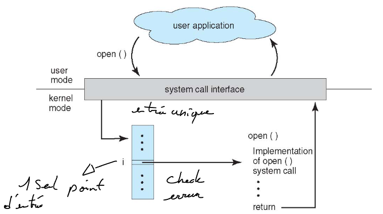
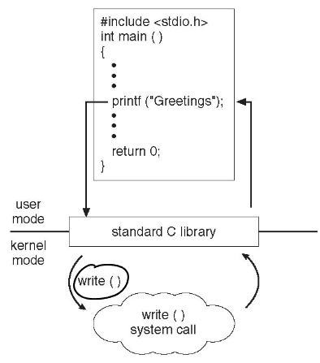
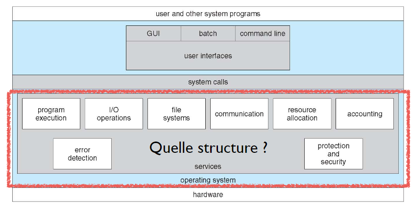
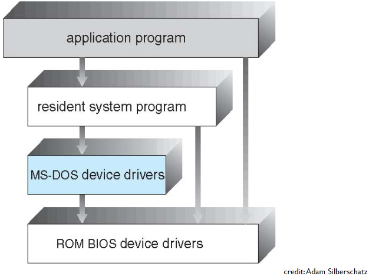
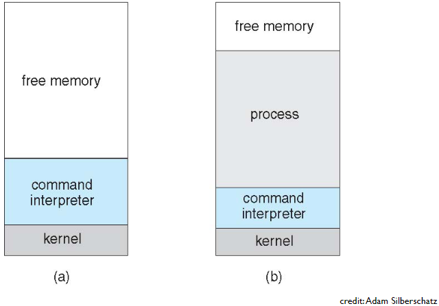
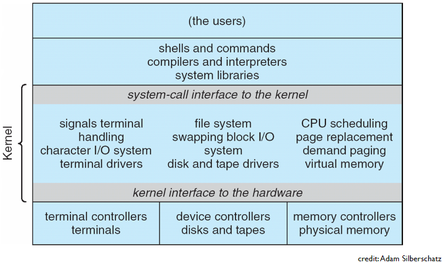
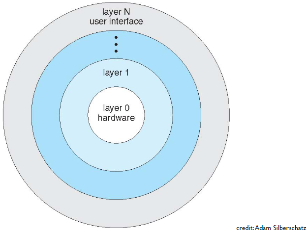
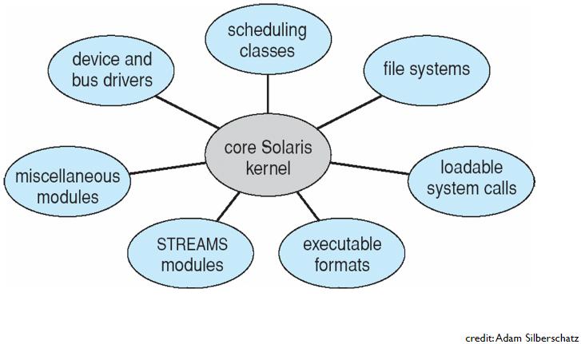
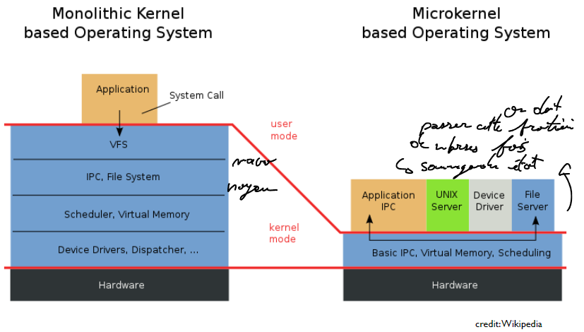

[↰](../README.md)

___

# Cours 5

- [Cours 5](#cours-5)
  - [Service](#service)
    - [Interface](#interface)
    - [Services aux concepteurs d'applications](#services-aux-concepteurs-dapplications)
    - [Services aux applications](#services-aux-applications)
    - [Accès aux services du SE](#accès-aux-services-du-se)
  - [Architecture des systèmes d'exploitation](#architecture-des-systèmes-dexploitation)
    - [Objectifs et contraintes de mise en oeuvre d'un SE](#objectifs-et-contraintes-de-mise-en-oeuvre-dun-se)
    - [MS-DOS](#ms-dos)
    - [UNIX](#unix)
    - [Macro- et Micro-noyaux](#macro--et-micro-noyaux)
    - [Fiabilité des SE](#fiabilité-des-se)
    - [Démarrage du SE](#démarrage-du-se)

## Service 

Un système d'exploitation fournit des services aux utilisateurs (aussi distant), aux développeurs et programmes qui s'exécutent.

### Interface
- Interface utilisateur: GUI ou terminal
- Interface de traitement par lot: comme Inginious, on a un ensemble de tâches qui s'exécutent groupe par groupe. (punch card)

On retrouve la dernière interface sur les HPC et autres types de super computer.

#### Sous linux

On a un système pour le batch (traitement par lot).

- `at`: lance une commande à un moment spécifique.
- `crontab`: gérer des tâches récurrentes.

### Services aux concepteurs d'applications

On facilite le déploiement d'applications sur d'autres systèmes que celui de la machine du dev via:
- **Linker**: Assemble différents fichiers *objets* en un *exécutable unique*
  - `ld` sur Linux
  - `-static` avec `gcc` pour avoir l'ensemble des libraires
- **Loader**: au démarrage d'un programme.
  - `ld.so` libraire et support du kernel Linux
    1. Initialise l'espace mémoire
    2. Pré-charge les segments text, data, environment
    3. Localiser et charger les libraires dynamiques

Il peut aussi gérer les erreurs. ex: *memory dump* pour avoir l'état de la mémoire avant le crash. Ce *memory dump* peut être déclenché si on fait une division par 0 ou accès non autorisé à certains segments de la mémoire.

On peut aussi facilement débugger via `gdb` et ses breakpoints. Les breakpoints sont en réalité des *trap* qui fait une interruption logicielle !

### Services aux applications

Le SE gère les entrées sorties mais il y a quelques règles:
- Une app **ne peut pas** envoyer d'instructions aux gestionnaires de périphériques
- **Ne peut pas** traiter les interruptions
- Hétérogénéité des périphériques eux-mêmes 
- SE fournit une abstraction unique pour une *classe* de périphérique

Un des buts du SE est de faire **correspondre** des abstractions *haut niveau* et des opérations *bas niveau*. On a des drivers qui permettent de contrôler le matériel.

Un SE va partager les ressources. Il va faire:
- Maximisation de l'utilisation
- Équité d'accès
- Isolation

Il fournit aussi d'autres services spécifiques:
- Allocations des ressources:
  - Exclusive ou non (typique des ports)
  - Contrôle générique ou spécifique
  - Protection et contrôle d'accès

### Accès aux services du SE
- Utilisation d'utilitaire systèmes
- Appel direct des fonctions du noyau
- Librairie Standard

On a une API par le noyau pour les *appels système*:
- A un numéro précis
- Point d'entrée unique pour accéder aux fonctions du noyau

#### Fonctionnement

1. Placer les arguments dans la pile 
2. Sauvegarde l'adresse de retour sur la pile
3. Modifier `%eip` pour que la prochaine instruction à exécuter soit  notre fonction
4. Fonction prend ses arguments 
5. Sauvegarde son résultat à un endroit (`%eax` par convention en IA32)
6. Fonction récupère l'adresse de retour sur la pile et modifie `%eip` pour retourner à la fonction appelante.



On change de mode d'exécution. On change d'espace mémoire !

#### Réalisation concrète 

Problème 1: placer des arguments qui seront accessibles par le noyau. On va le mettre soit dans:
- Un espace mémoire fixe dédié (data)
- Sur la pile
- Registres (`%ebx` pour premier argument puis `%ecx`)

Problème 2: adresse de retour
- Pointeur de programme sauvegardé sur la pile.
- Restauré au retour

Problème 3: appel effectif
- Passer en mode protégé
- Instructions spéciales (IA32 `int 0x80` crée une interruption) ou simplement `syscall`.
- Point d'entrée du kernel est connu par le processeur.



Problème 4: récupération du code de retour
1. Opération autorisée et paramètre corrects:
    - Résultat mis dans le registre `%eax`
    - Instruction de retour au mode utilisateur, dépile l'adresse de retour et positionne le compteur de programme
2. Erreur ou opération non autorisée
    - Positionne la variable d'environnement `errno`
    - Retourne aux processus parent (ex: shell)


#### Appels systèmes

- Librairie standard: s'exécute dans le même espace mémoire que le programme utilisateur. `printf(3)` va forcément utiliser `write(2)` ou autres opérations bas niveau.
- `strace(1)` permet de tracer les appels systèmes utilisés par un processus

.



#### Hello world

```c
#include <stdio.h>
#include <stdlib.h>

int main(int argc, char *argv[]){
   printf("Hello, world! %d\n",sizeof(int));
   return EXIT_SUCCESS;
}
```

Traduction:

```
$ strace ./helloworld_s
execve("./helloworld_s", ["./helloworld_s"], [/* 21 vars */]) = 0
uname({sys="Linux", node="precise32", ...}) = 0
brk(0)                                  = 0x9e8b000
brk(0x9e8bd40)                          = 0x9e8bd40
set_thread_area({entry_number:-1 -> 6, base_addr:0x9e8b840, limit:1048575, seg_32bit:1, 
contents:0, read_exec_only:0, limit_in_pages:1, seg_not_present:0, useable:1}) = 0
brk(0x9eacd40)                          = 0x9eacd40
brk(0x9ead000)                          = 0x9ead000
fstat64(1, {st_mode=S_IFCHR|0620, st_rdev=makedev(136, 0), ...}) = 0
mmap2(NULL, 4096, PROT_READ|PROT_WRITE, MAP_PRIVATE|MAP_ANONYMOUS, -1, 0) = 0xb778a000
write(1, "Hello, world! 4\n", 16Hello, world! 4
)       = 16
exit_group(0)                           = ?
```

## Architecture des systèmes d'exploitation 




### Objectifs et contraintes de mise en oeuvre d'un SE

- Pas de modèle unique et parfait
- Contraintes et objectifs:
  - Contraintes du matériel
  - Performance et coût d'implémentation
  - Consommation de ressources
  - Facilité d'évolution et d'adaptation
  - Facilité de maintenance et d'atteinte de fiabilité

### MS-DOS

SE des systèmes *IBM-PC* pas basé sur UNIX, c'est Microsoft.

Objectifs:
- Mono-utilisateur et mono-application (Pas de temps partagé)
- Visant des processeurs **ne supportant pas** les modes utilisateur/protégé (Pas d'isolation)
- Contrainte forte sur l'utilisation de la mémoire (coutait extrêmement cher à l'époque)


Système avec une vision **monolithique** pour éviter de consommer trop de mémoire.






### UNIX

#### Monolithe

Plus vieux que [MS-DOS](#ms-dos) mais pensé pour des ordinateurs à plus grande capacité.
- Multi utilisateur et temps partagé
- Processeur supportant les deux modes
- Séparation claire entre *noyau* et *programmes utilisateurs*

Organisation originelle: *monolithe*:
- 1 seul programme sur 1 seule couche, met en oeuvre tous les appels systèmes
- Difficile à étendre, adapter, débugger



#### Couches

On va rajouter de la structure pour pallier aux soucis lié à [unix monolithique](#monolithe)

Les couches:
1. Matériel
2. Drivers de périphériques
3. Abstractions des plus en plus haut niveau, jusqu'aux appels systèmes
4. Interface utilisateur



Il y a des avantages et inconvénients !

Avantages:
- Isolations des fonctionnalités
- Facilité de portage

Inconvénients:
- Surcoût à l'exécution des appels système
- Difficile de décider d'une structure purement hiérarchique. 
  - Il y a une interdépendance entre les fonctions du SE

#### Structure en Modules



Utilisé le plus souvent: Linux, Solaris, Windows

On a un coeur qui est un monolithe ou qui a peu de couche.
- Gestion bas niveau de la mémoire
- Gestion des processus

Le reste est sous forme de modules:
- Chargés et décharges de l'espace mémoire du noyau *dynamiquement*
- Seulement lorsque nécessaire
  - Ex: quand on met une clé usb. Va charger `exFAT` si clé venant de Windows

Avantages:
- Spécialisation d'une SE pour un environnement donné:
  - Versatilité de Linux
- Interactions possibles entre les modules en conservant la séparation de code et de mémoire.
  - Analogie possible avec programmation orientée objet

Inconvénients:
- Surcoût (négligeable sur les systèmes modernes)
- Intégration de modules écrits par des tiers dans l'espace mémoire du noyau
  - potentiels bugs et fautes

Gestions des modules sous Linux (seulement si `root`):
- `lsmod`: liste les modules présents
- `modprobe`: ajoute/supprime un module
- `modinfo`: information sur un module


### Macro- et Micro-noyaux

#### Macro-noyaux

Tous les modes précédents placent l'intégralité des fonctions du SE dans le noyau.
- Toutes s'exécutent en mode protégé
- Accès complet à la mémoire et aux instructions sensibles
- Crash du module = **crash du système**

Le kernel est en pérille, corruption des données, faille pour les hackers.

#### Micro-noyaux

Séparation entre un noyau minimaliste
- Gestion basique de la mémoire
- Gestion des processus légers (threads)
- Gestion de la communication entre processus (IPC)

Le reste est mis en oeuvre par des processus en mode utilisateur (même les drivers)

Réduit les bugs de modules et évitent les crash complets tout en gardant les propriétés d'isolation.



Inconvénients:
- En macro: appel de module dans un même espace mémoire donc très rapide. En micro: il faut faire des appels systèmes
  - Copie de l'argument de l'appelant vers le noyau
  - Copie dans l’espace mémoire de l’appelé
  - Changement de contexte (sauvegarde du contexte et restauration...)
  - ... et rebelote dans l’autre sens pour la valeur de retour

Donc on a longtemps abandonnés les micro-noyaux (abandon dans Windows NT) MAIS:
- Progrès sensibles dans la mise en oeuvre des appels systèmes
- Passage de message en mode zero-copy
- Mac OS et iOS proche d'un micro-noyau

### Fiabilité des SE

Souvent beaucoup de temps nécessaires pour corriger des fautes. Énormément de fautes dans les drivers et compliqués à débugger et trouver parfois.

#### Certification formelle

Pour les systèmes embarqués critiques on réalise des **spécification formelle**. On modélise *mathématiquement* qu'un système est fiable. C'est le cas pour seL4. Mais seulement possible si le code est petit.

### Démarrage du SE

Démarrage et reset de la machine: interruption de mise à zéro du processeur. 2 phases:

1. Programme de démarrage (bootstrap) stocké dans une ROM. Charge ainsi le bootloader
2. Bootloader lit les systèmes de fichiers pour charger l'image du noyau en mémoire (`/boot/vmlinuz-3.12.0-32-generic`) en gros le GRUB.

___

[↰](../README.md)