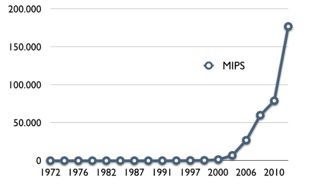
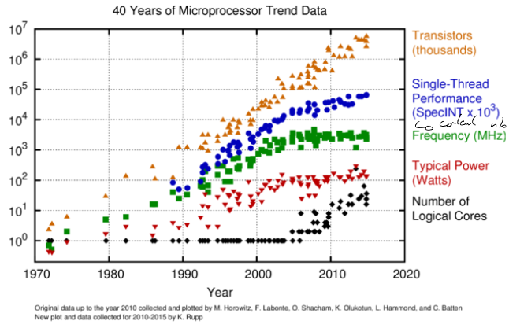
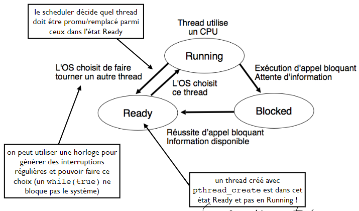

[↰](../README.md)

___

# Cours 6
- [Cours 6](#cours-6)
  - [Course à la performance](#course-à-la-performance)
    - [Horloge](#horloge)
    - [Augmentation des performances](#augmentation-des-performances)
  - [Threads](#threads)
    - [Qu'est-ce qu'un thread ?](#quest-ce-quun-thread-)
    - [Mise en oeuvre (POSIX)](#mise-en-oeuvre-posix)
    - [Communication entre thread](#communication-entre-thread)
    - [États](#états)
    - [MUTEX](#mutex)

## Course à la performance

Selon la loi empirique de Moore, tous les 18 mois, la quantité de transistor sur $1$ $cm^2$ double.

### Horloge

On sait que les processeurs fonctionnent sur des cycles régulés par l'horloge. On voit apparaître un plateau vers 2001 pour les fréquences d'horloge.

#### Raison

- *Memory Wall*: la différence entre fréquence CPU et RAM est trop importante. Demande plus de cache mais c'est cher
- *Instruction-Level Parallelism*: Même si possible de paralléliser les processus, on reste limité par les instructions bas niveaux.
- *Power Wall*: + de fréquence = + de consommation d'énergie = + de dissipation thermique. Cela devient compliqué à refroidir.

### Augmentation des performances



On voit bien que le *Millions d'Instructions par Seconde* augmente tout de même. 

Ces résultats sont démontrés via des **benchmarks standardisés**. (SPEC = organisation de standardisation de benchmarks)

#### Multi-coeurs

C'est grâce au multi-coeurs ! Le nombre de transistor augmente mais la fréquence est stable donc le nombre d'instructions par seconde augmente.

On peut ainsi avoir plusieurs **threads** qui s'exécutent en simultanée.



On ne remplit pas totalement tous les coeurs via un seul programme car il manque de parallélisme d'instruction (ILP). 

Les ressources du coeur sont partagées entre 2 fils d'instructions distincts:
- **SMT**: *Simultaneous Multi-Threading*
- 32 fils par coeur sur certains CPU
- 2 fils par coeur souvent (*Hyperthreading*)

Un peu inférieur: 16 threads < 16 coeurs

## Threads

### Qu'est-ce qu'un thread ?

Un threads est donc:
1. Instructions à exécuter (text)
2. Mémoires contenant les données manipulées (*data, heap, stack*)
3. Registres du CPU (son état actuel)

### Mise en oeuvre (POSIX)

Avec les threads POSIX: *threads du programme utilisateur = threads ordonnancé sur les coeurs par le noyau*. En gros le gain des threads POSIX se fait sentir jusqu'à ce que le nombre de threads du programme atteignent ceux du CPU (cfr: Projet 3).

#### Utilisation

On utilise la libraire `pthreads(7)` et à la compilation on doit passer le flag `-lpthread` à gcc.

```c
#include <pthread.h>

int pthread_create(pthread_t *restrict thread,
                   const pthread_attr_t *restrict attr,
                   void *(*start_routine)(void *),
                   void *restrict arg);
``` 

- `thread`: structure de donnée provenant de `pthread.h`
- attributs: `NULL` par défaut
- `start_routine`: pointeur sur la fonction, point de départ du thread
- `arg`: arguments à passer à notre fonction de `start_routine`

Retourne $0$ si aucune erreur.

#### Récupérer la valeur de retour

```c
#include <pthread.h>

int pthread_join(pthread_t thread, void **value_ptr);
```

- `thread`: thread concerné.
- `value_ptr`: pointeur où on va récupérer la valeur.

`pthread_join` ne retourne qu'à la terminaison du thread. Donc on attend jusqu'à la fin de son exécution.

#### Fonctionnement

Au moment d'exécuter `pthread_create` la pile du thread est créée et la valeur de l'argument y est copié. Donc on doit s'assurer que le pointeur passé soit toujours valide à n'importe quel moment. Moment de l'exécution du thread inconnu.

Dans un thread, il a un nouveau stack et contexte (%esp, %eip, registres). Cependant il utilise le heap, les données statiques et le text du processus principal.

### Communication entre thread

On va utiliser des locks pour pouvoir accéder à des variables globales sans se marcher dessus. 

On doit d'abord s'assurer de gérer les interruptions pour les **changements de contexte**. On fait cela via:
- Appel système bloquant
- Réception d'une interruption:
  - Signal électronique reçu par le processeur pour signaler la disponibilité d'une E/S
  - Ou via un timer régulier.

Appel bloquant comme `getchar` qui attend une entrée utilisateur.

### États



#### Laisser la main

Un thread peut libérer le processeur via `pthread_yield` pour ne pas bloquer (appel sys bloquant `sleep`/`usleep`). 

Il faut faire attention au blocage de la machine suite à l'arrêt des entrées/sorties.

### MUTEX

C'est un objet qui va être **unlocked** si on peut y accéder et **locked** si on ne peut pas. On utilise les fonctions `lock()` et `unlock()`. 

Si un thread appelle `lock()` et que le mutex est déjà bloqué, alors le thread sera interrompu et placé en mode **Blocked** jusqu'à ce que le mutex soit libéré. `lock()` peut créer un appel sys bloquant.

#### Deadlock

cela se passe quand tout se bloque à cause de mutex (cfr: 3 philosophes 3 baguettes). On peut forcer que les appels bloquants se fassent par ordre croissant d'adresse pour éviter ce problème.

___

[↰](../README.md)
