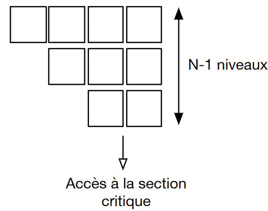
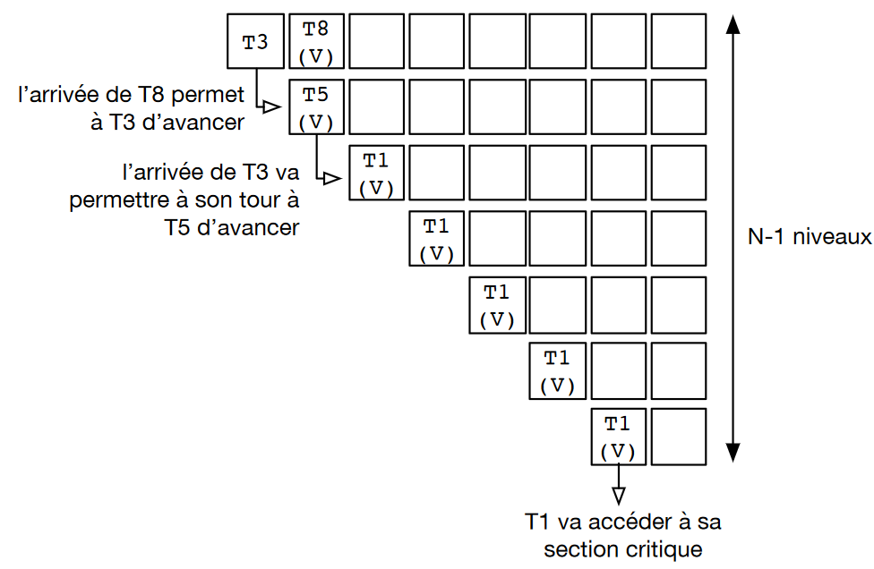
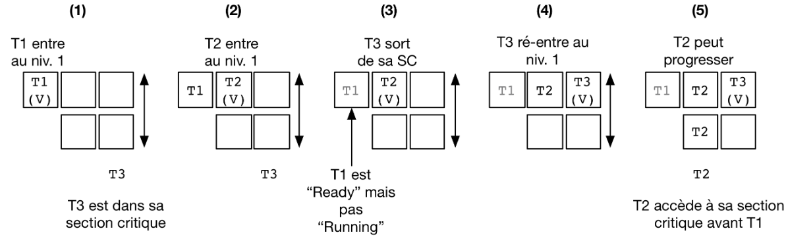
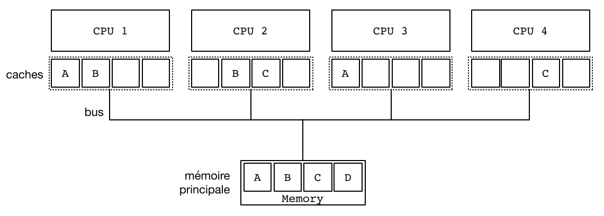
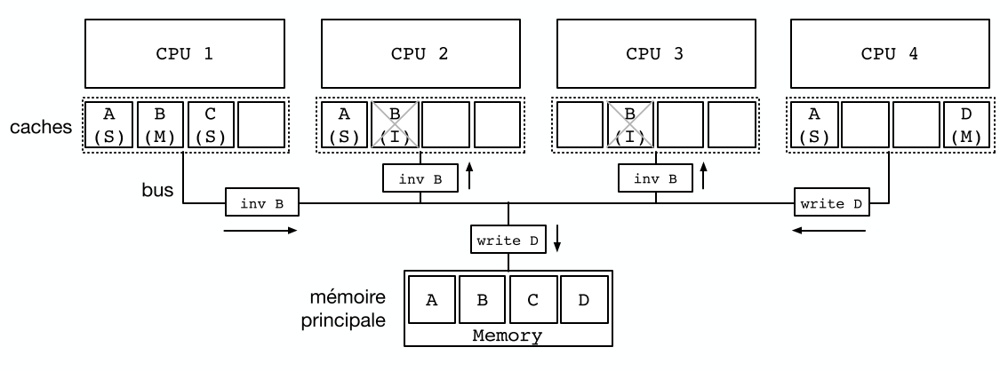
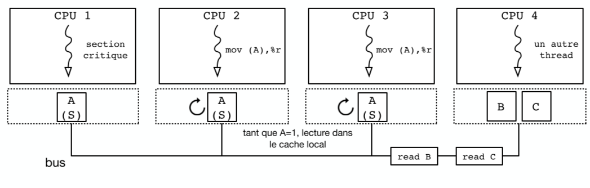

[↰](../README.md)

___

# Cours 8

- [Cours 8](#cours-8)
  - [Rappel](#rappel)
  - [Problème d'exclusion fondamentale](#problème-dexclusion-fondamentale)
    - [Résultat Théorique](#résultat-théorique)
    - [Essais et Erreurs](#essais-et-erreurs)
  - [Algorithme de Peterson](#algorithme-de-peterson)
  - [Algorithme du filtre](#algorithme-du-filtre)
    - [Équité](#équité)
  - [Bakery Algorithm](#bakery-algorithm)
- [Utilisation des Opérations Atomiques](#utilisation-des-opérations-atomiques)
  - [Instructions `xchg`](#instructions-xchg)
    - [Exclusion Mutuelle](#exclusion-mutuelle)
    - [Attente Active (spinlocks)](#attente-active-spinlocks)
    - [Mutex POSIX](#mutex-posix)
  - [Test-and-set `xchg`](#test-and-set-xchg)
    - [Utilisation du Cache](#utilisation-du-cache)
    - [Protocole de Cohérence de Cache MSI](#protocole-de-cohérence-de-cache-msi)
    - [Instructions Atomiques \& Utilisation du Bus](#instructions-atomiques--utilisation-du-bus)
  - [Conclusion](#conclusion)

## Rappel

On se souvient que l'accès à une variable partagée doit être protégée. soit via:
- Mutex: `lock()` et `unlock()`
- Sémaphore: `wait()` et `post()`

## Problème d'exclusion fondamentale

### Résultat Théorique

il est impossible de réaliser un algorithme d’exclusion mutuelle pour N threads avec moins de N valeurs partagées si on utilise uniquement des opérations de lecture et d’écriture.

### Essais et Erreurs

#### Les bases

Si on a 2 threads qui doivent accéder à une section critique, il faut garantir:
- La *Safety*: ils ne vont pas y accéder de manière conjointe
- La *Liveness*: ils doivent y accéder en un temps fini.

#### Premier Essai

On peut utiliser une variable `turn` qui indique l'envie d'un thread d'arriver en zone critique.

```c
// thread 1 
while (turn!=0) { 
    /* loop */ 
} 
section_critique();
turn=1;

// thread 2 
while (turn!=1) {
    /* loop */ 
} 
section_critique();
turn=0;
```

On respecte bien l'exclusion mutuelle puisque pour que les deux threads s'exécutent simultanément, il faudrait que `turn = 1` et en même temps `turn = 0`.

Mais pour la **liveness**, si le thread 1 a fini de s'exécuter et qu'il veut ré-exécuter il ne pourra pas le faire tant que le premier thread ne s'exécute ce qui est problématique.

- **Safety**: ✅
- **Liveness**: ❌


#### Second Essai

Ici, l'approche consiste à utiliser un tableau de *flag* qui indique si le thread veut s'exécuter. Donc une valeur de `1` à l'emplacement 0 indique que le thread 1 veut s'exécuter.

```c
// Thread A 
while (flag[B]==true) {
    /* loop */ 
}
flag[A]=true;
section_critique();
flag[A]=false;

// Thread B 
while (flag[A]==true) { 
    /* loop */
} 
flag[B]=true;
section_critique();
flag[B]=false;
```

La **Liveness** est bien respecté car le thread A est seulement bloqué si le thread B est dans session critique. 

Les threads peuvent simultanément lire `flag[A]` et `flag[B]` a `false` et sortir de leur zone critique. 

- **Safety**: ❌
- **Liveness**: ✅

#### Corriger le problème

On peut déplacer l'assignation comme suit:

```c
flag[A]=true; 
while (flag[B]==true) { 
    /* loop */ 
} 
section_critique();
flag[A]=false;
```

On perd la propriété de *Liveness* même si on retrouve celle de *safety*. Ils peuvent mutuellement se bloquer s'ils veulent tous les deux s'exécuter.

- **Safety**: ✅
- **Liveness**: ❌

## Algorithme de Peterson

```c
#define A 0 
#define B 1 

int turn = A;
int flag[]; 
flag[A]=false;
flag[B]=false;

// thread A 
flag[A]=true; 
turn=B; 
while((flag[B]==true)&&(turn==B)) { 
    /* loop */ 
} 
section_critique();
flag[A]=false;

// Thread B 
flag[B]=true; 
turn=A; 
while((flag[A]==true)&&(turn==A)) {
    /* loop */
}
section_critique();
flag[B]=false;
```

L'idée ici est d'avoir un système qui montre quel thread a l'intention de s'exécuter via `flag[]` et une variable qui montre c'est à qui le tour `turn`.

**Safety**: Pour que les deux threads soient en section critique, il faut que ``flag[] = {true, true}``. Ce qui peut être probable en même temps car lu à différent moment. Il faut aussi que `turn = A` et `turn = B`, ce qui n'est évidemment pas possible. (pour  `flag[]` ce n'est techniquement pas possible en vrai).

**Liveness**: Si jamais le thread A veut s'exécuter et pas le thread B, on aura des variables de valeur `flag[] = {true, false}` et `turn = A`. Mais on aura pas de *livelock* car `turn = A` ou `turn = B`.

## Algorithme du filtre

Peterson ne fonctionne que pour 2 threads, donc il faut trouver un moyen d'étendre cette idée. On va utiliser l'algorithme de filtre sur N threads (N étant connu à l'avance) à l'avance.

On a ainsi **N-1 niveaux** et chaque niveau est une salle d'attente



Si des threads veulent passer il faut que:
- Au moins 1 passe
- Au moins 1 reste

Quand on est au dernier niveau avec 2 threads, un des deux passe et l'autre attend.

Pour mettre cela en oeuvre, un thread qui annonce qu'il rentre dans un nouveau niveau va laisser passer les autres d'abord.

On a 2 tableaux partagés.
1. `level[N]`: indexé par le **numéro de Thread** et indique son niveau
2. `victim[N]`: indexé par le **niveau** et dit quel thread est en attente.

```c
// Thread i
// Parcours des niveaux 1 à n-1
for (int L = 1; L < N; L++) {
    // Annoncer l'intention de rentrer au niveau L
    level[i] = L;
    // Le thread se désigne comme la victime pour ce niveau
    victim[L] = i;
    // Attendre tant qu'il existe au moins un thread au même niveau ou à un
    niveau supérieur,
    // et que le thread i est la victime du niveau où il se trouve
    int t_niv_sup_egal = 0;
    do {
    for (int j=0; j< N; j++) {
        // parcours du tableau des niveaux pour déterminer si un thread
        // est au même niveau ou à un niveau supérieur
        if ((j!=i) && level[j] >=L) {
            t_niv_sup_egal = 1;
        }
    }
    } while (t_niv_sup_egal && victim[L]==i);
}
section_critique();
// Libération de threads bloqués en attente dans les niveaux inférieurs
level[i]=0;
```

Si on décompose le code, on voit qu'un thread progresse si:
- Il n'y aucun thread en attente à son niveau
- Il y a un autre thread qui a pris le rôle de victime.

Au plus N-L threads peuvent dépasser le niveau L. Donc au plus 1 seul thread peut accéder au niveau N-1.



### Équité

On n'a pas la garantie qu'un thread arrivé en premier tout au-dessus des niveaux va s'exécuter que ceux arriver ! Cela dépend du temps alloué par le processeur et ce cas de figure ci peut se passer:



Ceci arrive à partir de 3 threads.

On peut donc définir l'équité et rendre l'algorithme plus équitable (permettant d'assurer la propriété de **liveness**). On va subdiviser en 2 la partie d'accès à la section critique:
1. *Doorway*: en un nombre de pas borné, configuration de variables partagées
2. *Waiting*: boucle `while()` qui vérifie une condition.

Garantie formelle d’équité : si la section doorway $D_A$ d’un thread $T_A$ termine avant le début de la section doorway $D_B$ d’un thread $T_B$, alors $T_A$ a la garantie d’accéder à sa section critique avant $T_B$.

À savoir qu'on peut avoir une exécution concurrente de $D_A$ et $D_B$ et donc l'ordre peut être arbitraire. On peut aussi avoir le *k-bounded waiting* donc pas plus de k sections critiques de différences entre deux threads. FIFO c'est un 1-bounded waiting.

## Bakery Algorithm

Se base sur les tickets de boucherie. On doit toujours savoir combien de threads on a à l'avance. On a également 2 tableaux partagées:
1. `drapeau[N]`: indexé par le **numéro du Thread** et indique s'il veut rentrer en SC.
2. `ticket[N]`: indexé par le **numéro du Thread** et indique le numéro dans la file.

**HYPOTHÈSES:** On a également des sections **doorway** qui ne sont jamais concurrentes. On aura jamais 2 threads avec le même numéro de ticket.

C'est **complètement** irréaliste de penser cela !! Par exemple, 2 threads peuvent observer le même état et donc prendre le même numéro de ticket !

Donc on doit juste définir un **ordre de passage** pour les threads ayant le même numéro ! Le plus simple est de prendre le thread avec le plus petit numéro.

```c
// Thread i
// Section doorway : annoncer son intérêt et obtenir un ticket
drapeau[i]=1;
int t=0;
// Parcours des tickets
for (int j=0; j<N; j++) {
    if (ticket[j]>t) {
        t = ticket[j];
    }
}

// Prise du ticket supérieur
ticket[i]=t+1;
// Section waiting : attendre son tour ...

do {
    int mon_tour = 1;
    // Parcours des tickets des autres threads dont le drapeau est levé
    for (int j=0; j<N; j++) {
        if (drapeau[j]) {
            if ((ticket[j] > ticket[i]) || ((ticket[j]==ticket[i]) && j>i)) {
            // Il y a un autre thread actif devant dans la file ...
                mon_tour = 0;
            }
        }
    }
} while (!mon_tour);

section_critique();
// Libération de threads en attente avec les tickets suivants
drapeau[i]=0;
```

Ici, on utilise que des lecteurs écrivains pour mettre en place les threads. On ne communique pas au *scheduler* ce qui est mis en pause. Ce n'est pas très optimal car on risque de donner de la ressource à un thread qui ne peut progresser.

On pourrait faire des opérations sur le processeur pour palier à ça mais ça ne va pas fonctionner ! En effet, l'ordinateur va ré-arranger les instructions et les optimiser donc l'ordre d'exécution n'est pas garanti.

Utiliser le mot-clé `volatile` pour forcer le programme à relire tout le temps la valeur ne va pas non plus résoudre le problème à cause des ordres d'exécution "*aléatoires*". (Il existe des barrières pour forcer des contraintes d'accès à la mémoire `MFENCE`, `LFENCE` et `SFENCE`)

On va préférer utiliser des opérations atomiques


# Utilisation des Opérations Atomiques

Une opération est: *une opération qui ne peut être interrompue par l'arrivée d'une interruption*. On réalise cela via un registre et un mot mémoire. Les opérations sont donc exécutées de manière **séquentielle**.

## Instructions `xchg`

```assembly
xchgl %eax, (var) 
```

Équivalent:

```assembly
movl (var), %ebx
movl %eax, (var)
movl %ebx, %eax
```

On a une exclusion mutuelle en utilisant simplement un unique mot mémoire partagée (ils vont donc tenter d'écrire dans une variable lock 1 qui était libre 0).

### Exclusion Mutuelle

Après un appel à un `xcgh` il y a deux possibilités:
1. `%eax` contient 0 : l’adresse (``lock``) a été mise de 0 à 1. 
   * Donc est maintenant réservé et le thread peut rentrer en SC.
2. ``%eax`` contient 1 : l’adresse (``lock``) a été mise à 1 mais valait déjà 1 avant l’appel ! 
   * Donc le ``lock`` n'était pas libre ! On va donc boucler et ré-essayer

C'est une approche *test-and-set*.

### Attente Active (spinlocks)

Les algorithmes basées sur une boucle `while` qui check une condition à chaque fois sont appelés des algorithmes *spinlocks*.

Cela fait du travail inutile pour le processeur. Vraiment problématique pour du code sur mono-coeur car c'est inutile !


### Mutex POSIX

On va ici utiliser le support du **Système d'Exploitation**. Si un thread veut faire un `lock()` sur un mutex *déjà bloqué* alors ce thread sera mis en état **blocked**. Il est maintenant dans une file d'attente pour que le mutex soit `unlock()`.

**Avantages:** On perd pas de ressources inutilement. Utile pour gérer les sections critiques.

**Inconvénients:** On a une grande latence entre l'appel `lock()` et l'exécution de la section critique.

#### Comparaison

**Attente active** que sur multi-processeur. Utile pour les sections critiques courtes. Fort utilisé dans le noyau !

**Mutex** plus efficace pour mettre en oeuvre la synchronisation avec équité. On ne schedule pas des threads non prioritaires avant ceux qui doivent accéder à leur SC en premier.

## Test-and-set `xchg`

Si on utilise cet algorithme avec un `xchg` c'est **catastrophique**. On a une latence d'accès au sections critiques qui augmentent avec le nombre de threads.

Ceci est causé par le **cache** !



On a donc un cache pour chaque coeur et les adresses mémoires récemment utilisées. Mais on a aucun moyen de s'assurer de la cohérence du tout.

### Utilisation du Cache

On utilise donc le *bus* pour coordonner la mise à jour et l'invalidation de leur contenu. 

On a chaque contrôleur qui *snoop* le bus. Un seul contrôleur peut utiliser le bus à un moment. La mémoire va donc écouter le bus et répondre aux requêtes de lecture/écriture.


### Protocole de Cohérence de Cache MSI 

Chaque ligne de cache a donc 3 états:
- **M** *modified*: la valeur en cache est plus récente que celle en mémoire principale.
- **S** *shared*: lignes présentes à d'autres endroits et identiques.
- **I** *invalid*: on ne peut pas utiliser cette ligne. L'accès doit retourner vers le bus pour avoir la version la plus à jour.



Donc pour écrire une ligne en mode S, le contrôleur de cache doit invalider les autres copies de S et passer la ligne en mode M.

Avec cela, on peut assister à un phénomène de ping-pong entre les caches si deux threads s'exécutent sur des processeurs différents. À chaque modification, un des deux threads doit invalider la valeur chez l'autre et modifier le tout.

Le **faux partage** arrive lorsque deux variables distinctes sont dans la même ligne de cache.

### Instructions Atomiques & Utilisation du Bus

Avec un `xchg`, on doit avoir accès à la ligne de cache en mode **M** mais aussi assurer qu'aucune opération concurrente ne soit possible. Il faut verrouiller le bus le temps de l'exécution.

Donc il y a un coup pour le processeur qui l'exécute pour assurer l'atomicité mais aussi pour les autres car ils ne peuvent plus rien exécuter.

Donc on va saturer via un test-and-set le bus de message d'invalidation et en le bloquant.


#### Solution: test-and-test-and-set

On tire profit que tant que la variable `lock` est à 1, le thread $T_A$ exécute sa section critique. On va éviter de faire des appels à ``xchg``. Tant que `lock` est à 1 on peut faire une lecture depuis le cache et si on lit 0 alors il tente d'appeler `xchg`.

```c
while (test_and_set(verrou, 1)) { 
    // on a pas obtenu le verrou car on a lu 1 
    // donc on attend de lire 0 pour tenter à nouveau while (verrou) {}
}
```



Cela va réduire sensiblement le traffic et l'immobilisation du bus quand la contention est élevée. Mais cela impact toujours de manière non négligeable.

Dès que `lock` est libéré tous les autres threads se jettent pour appeler `xchg`. Des essais infructueux a de lourds impacts sur le système. Cela augmente la contention.

#### backoff-test-and-test-and-test

On peut aussi attendre et revenir plus tard !

Si lors d'un second essai la contention est toujours forte on va attendre encore plus longtemps. On adapte les ressources nécessaires en fonction du trafic.

On va souvent utiliser du **exponentiel-backoff**. Si on arrive pas du premier coup, on va attendre un temps aléatoire entre ``[0:v]`` avec $v=v_{init}$. Au deuxième essai, on attendra $v=v*2$ et cela jusqu'à $v_{max}$ et on ne doit pas utiliser d'appel système pour l'attente.

## Conclusion

* Le problème fondamental à résoudre pour construire des primitives de synchronisation est celui de l’exclusion mutuelle
    * Avec des garanties de liveness : pas de *livelock* ou d’hypothèses sur l’entrelacement des opérations
* Algorithmes classiques difficiles à utiliser sur les architectures modernes car fondés sur des hypothèses sur l’ordre des accès mémoire et une utilisation de la mémoire en $O(N)$
* Utilisation d’instructions atomiques pour résoudre l’exclusion mutuelle avec $O(1)$ mot partagé
*  Attention à la mise en oeuvre et à l’impact sur le cache et la
performance !


___

[↰](../README.md)
