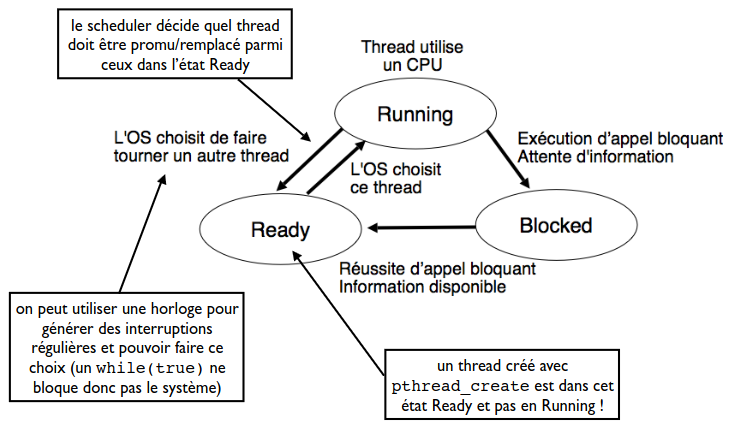

# Scheduling

## Rappel

Les SE tel que Linux supporte d'avoir un grand nombre de thread (parfois sur des mono-processeurs). On doit donc partager. On crée l'illusion de continuité.

## Mécanisme & Politique

- **Mécanisme:** (*ex:* changement de contexte (sauvegarde et restauration)) cela permet d'**acter des décisions de placement de threads sur les processus**.
- **Politique** (*ex:* scheduler ) cela permet de **prendre des des décisions de placement** (ou va chaque threads).

Donc on peut avoir plusieurs politiques possibles sur la base du même mécanisme.

### Exécution des Threads

On a une alternance entre:

1. **Burst CPU**
2. **Opération bloquante**

Sur le schéma ci-dessus, on voit la durée de différent burst CPU et les moments d'attente.

### Évolution de l'État d'un Thread

#### Passage de *Running* à *Blocked*

- Appel système *bloquant* (ex: *pthread_mutex_lock(3 posix)*, *read(2)*, *sem_wait(3posix)*)

Les threads en état Blocked associés à une structure de donnée jouant le rôle d'une *salle d'attente*.

* *Thread Unique*: attente de la fin d'une entrée/sortie demandée par ce thread
* *Plusieurs Threads*: attente sur une ressource partagée (type *sémaphore* / *mutex*)

On a aucune garantie sur l'ordre de réveil de thread

#### Passage de *Running* à *Ready*

On va sé prémunir des programmes qui sont *infiniment* en mode *ready*.

Le SE va faire des interruptions périodiques générées par une horloge. Ensuite, le SE peut décider de **ne pas restaurer** le thread Running. On appelle cela la **préemption**.

#### Passage de *Ready* à *Running*

Le *Scheduler* a décidé de restaurer l'état de ce thread sur le processeur.

## Scheduler

Le *Scheduler* fait une **politique d'ordonnancement**. Ce dernier prend des décisions à deux occasions:

1. **Processeur disponible**: à la fin d'un CPU Burst.
2. **Interruption périodique**: peut arriver pendant un CPU Burst.

Dans le cas 2. le scheduler est donc **préemptif**.

#### Scheduler Universel

Il n'y a pas de scheduler parfait.

### Objectifs

On doit faire un compromis entre différents objectifs:

- **Objectifs Systèmes:**
  - Maximiser l'utilisation processeur
  - Maximiser le débit applicatif 
- **Objectifs pour chaque Application:**
  - Minimiser le temps d'exécution total (pas de sens pour application interactive)
  - Minimiser le temps d'attente (entre *Ready* vers *Running*)
  - Minimiser le temps de réponse (entre *Ready* vers *Blocked*)
  - Équité des métriques

### Scheduler FCFS

**First-Come First-Serve**. Le scheduler est donc non préemptif car un thread Running complète tout son burst CPU.

Ainsi avec 4 threads avec un temps d'exécution respectif de 5,4,2 et 7 secondes. On peut avoir une attente moyenne de 7 ou 5 secondes.

Ce n'est pas optimal pour des burst CPU plus court qui sont coincés derrière des burst plus long.

### Scheduler SJF

Choisit le thread Ready avec le burst CPU le plus court. Toujours non préemptif. Et va trouver le temps le plus court (dans notre exemple d'au-dessus, le temps d'attente moyen le plus court est 4.25 secondes).

Mais connaître le temps d'arrêt d'un thread revient à transgresser le **problème de l'arrêt**. 

On peut néanmoins prédire les prochains burst basés sur les précédents. On va donc utiliser des moyennes pondérées comme estimation.

Avec ce type d'organisation, les bursts les plus longs risquent de rester bloquer derrière les plus courts de manière indéfinie.

### Scheduler Préemptif RR

On peut libérer le processeur à chaque tick de l'horloge système. C'est un équivalent de *Round-Robin* (ruban rond).

- ✅ Ainsi, on a un temps d'attente moyen assez court.
- ❌ Pas de relation directe entre *attente* et *temps de réponse*
- ❌ Beaucoup de changement de contexte
- ❌ Pas de distinction entre threads avec bursts courts et longs

#### Fréquence d'horloge

Au + la fréquence est haute, au - temps d'attente des threads **mais** + de consommation d'énergie et - d'utilisation utile du CPU

- 1990: 100 Hz
- 2000: 1 kHz
- 2010+: fréquence adaptive (base clock et boost clock). Pas de réveil d'un processeur en veille si pas de thread *Ready*. Pas d'interruption si un seul thread *Running* et pas de *Ready*.

### Scheduler à Priorité

Pas la même priorité pour différentes applications: *daemon* vs *application utilisée par l'utilisateur à l'instant t*.

Pareil pour les threads, certains vont demander de la réactivité et des ressources et d'autres non.

On va exécuter le thread avec la plus haute priorité d'abord. On maintient une liste circulaire. Il faut faire attention au problème de famine

#### Problème de Famine

On utilise des priorités adaptatives (*basse* et *courante*).

Au départ: priorité courante = priorité de base

À chaque exécution d'un burst CPU, la priorité courante diminue. On réalise un nouveau cycle quand tous les threads ont une priorité courante = 0.

#### Tout Combiner

On combine les principes de priorité + préemption.

- Thread passe Running: on lui alloue un temps d'exécution maximale = **quantum** (longueur du quantum = multiple de la période de l'horloge système).
- Thread termine dans les temps sinon préemption.
- Utilisation de priorités fixes et courantes (courante diminue à chaque burst CPU).

#### Synchronisation des Threads

Il vaut mieux laisser un thread de priorité basse finir sa section critique plutôt que de la préempter. 

- ***Priority ceiling:*** `pthread_mutexattr_setprioceiling()`
  - Associe un mutex de priorité donné au thread le temps de sa SC. Fixé au max des priorités des threads accédant au mutex.
  - Évite la préemption par le thread de priorité plus élevée. Risque d'interférence avec les autres threads haute priorité dy système car fait systématiquement.
- ***Priority inheritance:*** 
  - La priorité du thread avec un mutex est fixée au max de celle des threads en attente sur ce mutex.
  - N'évite pas la première préemption mais booste la priorité d'un thread de priorité faible dans le cas général.

#### Priorité des Processus

Par défaut, les threads d'un processus héritent de la priorité du premier thread du processus. Dépend donc de l'environnement d'exécution. 

Si on est pas `root`, on ne peut pas demander des priorités plus élevés mais *seulement* plus faibles. 

On fait cela via l'utilitaire `nice(1)` ou la fonction `nice(2)`.

- $>0$: priorité plus faible (jusqu'à 20)
- $<0$; priorité plus élevé (jusqu'à -19)

## Conclusion

À la base d’un même mécanisme de changement de contexte, plusieurs politiques différentes possibles

- On peut utiliser de l'apprentissage automatique pour améliorer les paramètre d'un scheduler

Dans Linux, les priorités sont dynamiques et prise en compte des threads *interactifs*/*intensifs* en CPU.

- Le noyau supporte de nombreux scheduler différents
- Chaque scheduler peut être paramétré
- Critique pour la bonne performance et l’efficacité énergétique

